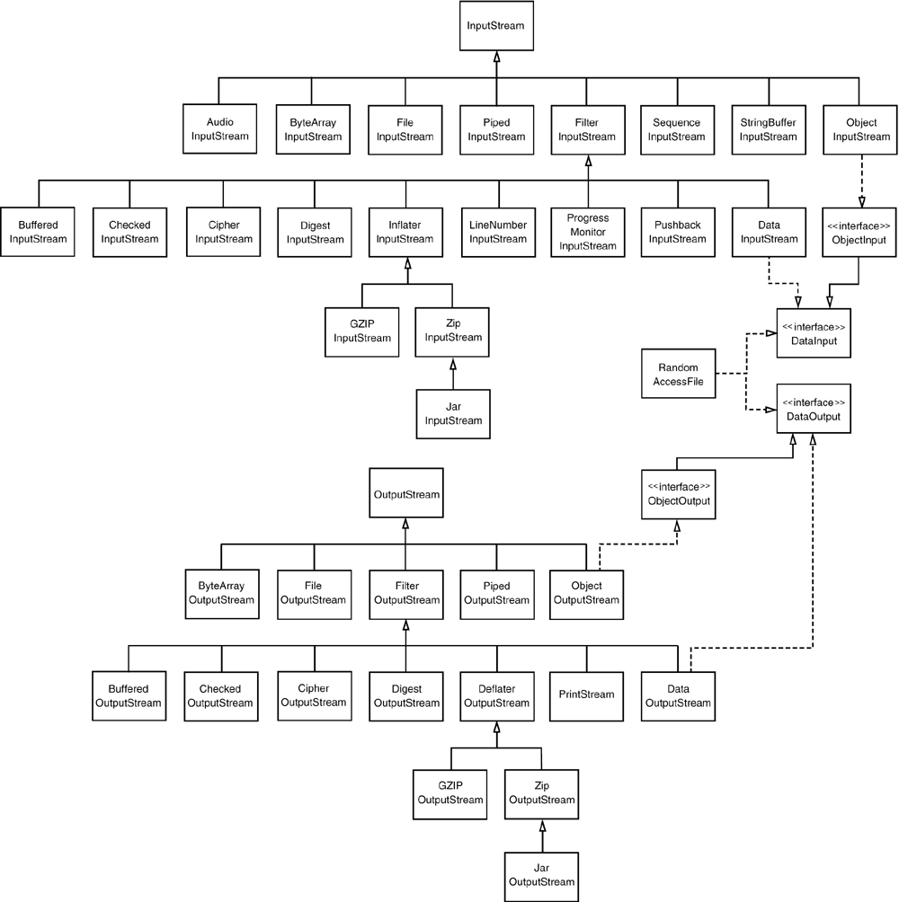
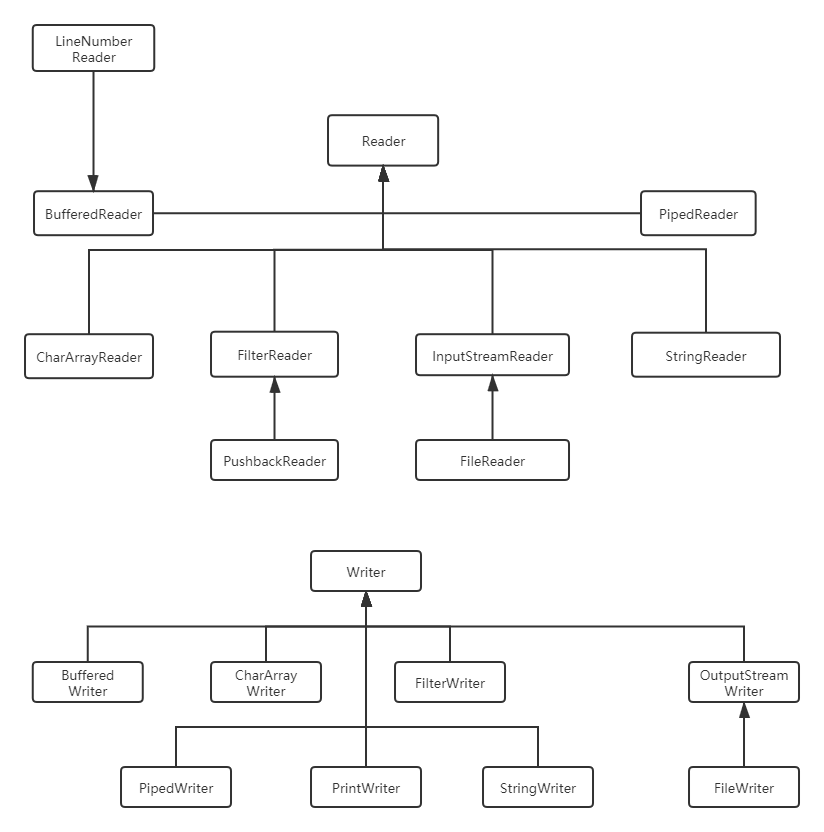
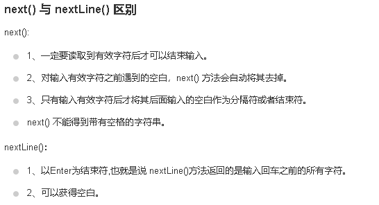
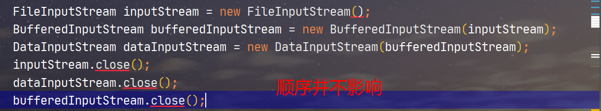
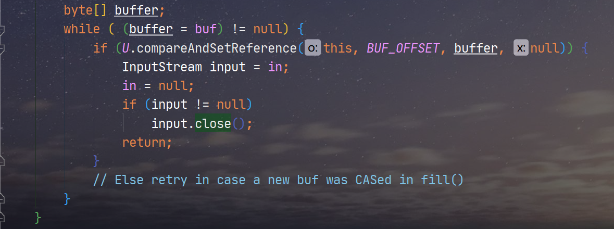
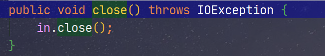
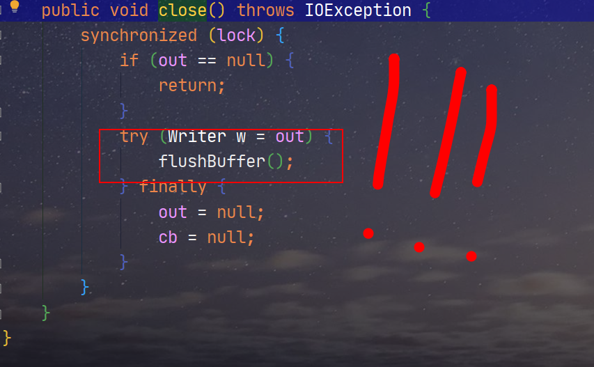
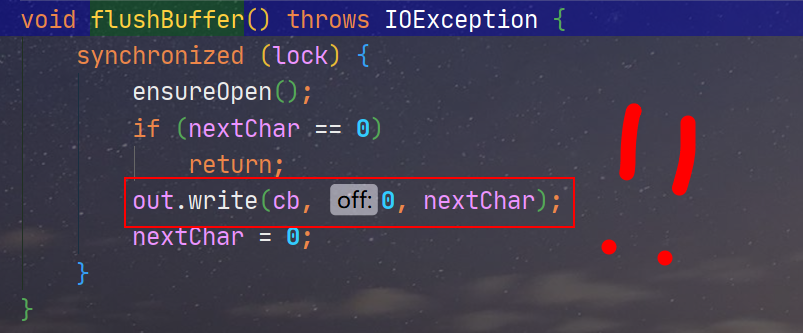

## 简介

写这篇文章已经一年了。

## Java-IOStream

`Java`的`IO`读写分成了两类，一类是处理计算机看的字节，也叫字节流（`XXXXInputStream`和`XXXXOutputStream`），一类处理字符，也叫字符流（`XXXReader`和`XXXXWriter`）

无论是处理字符的，还是处理字节的IO流，大体上可以分成三种类型：

- 节点类
- 装饰类
- 转化类

其中节点类是基础的IO定义，如：`InputStream`、`OutputStream`、`Writer`、`Reader`这四个。

装饰类是继承这些节点类，专门负责某一个或者一块IO功能的类，如：`PushbackInputStream`、`FileInputStream`、`PrintWriter`等。

转化类是字符流和字节流之间的转换，代表有两个：

- `InputStreamReader`：负责字节转为字符
- `OutputStreamWriter`：字符转为字节输出到文件中

上面的这三类`IO`都会在本篇中一一介绍。

### 输入输出字节流

在`JavaAPI`中，**可以从其中读入一个字节序列的对象为输入流，可以从其中写出一个字节序列的对象为输出流。**

**抽象类**`InputStream`**和**`OutputStream`**构成了基本的**`I/O`**结构**，`Java`拥有一个流家族来满足不同的需求。



### 节点类

`InputStream`是所有输入类的抽象父类，该类定义了：

```java
public abstract int read();						// 读入一个字节，并返回，碰到输入流结尾返回-1，所有子类必须重写该方法。
public int read(byte[] b);						// 读入一个字节数组，返回实际读入的字节数
public int read(byte[] b, int off, int len);	// 读入一个字节数组，从off开始，长度len，返回实际读入的字节数
public byte[] readAllBytes();					// 读入当前流中的所有字节
public int transferTo(OutputStream out);		// 将该输入流的字节抛给输出流，返回实际抛给的字节数
public long skip(long n);						// 跳过n个字节
int available()									// 返回不阻塞的情况下可获取的字节数
void close()									// 关闭这个输入流

public boolean markSupported()					// 如果这个流支持打标记，则返回true
public void mark(int readlimit);				// 对当前位置readlimit打标记，如果已经读入的字节超过readlimit，则忽略标记
public void reset()								// 返回最后一次标记的地方继续读取数据
```

其他的`API`都已经很明确用途了，这里只讲一个`available()`

`read()`、`Write()`执行都会阻塞，直至字节确实被读入或者写出了。通俗点说，**在操作流的时候，流是不能说访问就访问的，要等到流中确实有字节了，才可以真正访问**，特别在**网络套接字IO通信中，网络连接繁忙的时候**，字节被放进流里面**可能需要很长时间**，因此程序可能会**停下来等待**。

因此在调用`read()`、`Write()`之前使用`available()`可以避免阻塞。

```java
int byteAvailable = in.available();			// 读入可访问的字节数
if(byteAvailable > 0){						// 如果有字节，读入，没有则先不读，把控制权交还给程序
	byte[] d = new byte[byteAvailable];
	in.read(d);
}
```

还需要强调一点，**读取流的时候，流的内容并不会因为被读取了而从流中被抽出来**（当然像`PushbackInputStream`这种具备这样能力的流除外），实际上流的读取是靠内部的移动指针决定的，因此有些流可以支持一种**标记重读的能力**，具体可以参考`demo`：

> src/main/java/cn/argentoaskia/demo/InputStreamDemo.java

`OutputStream`是所有输出类的抽象父类，该类定义了：

```java
public abstract void write(int n)				// 写出一个字节的数据。
public void write(byte[] b)	
public void write(byte[] b, int off, int len) 	// 写出全部字节或者部分字节到byte数组
public void close()
public void flush()								// 刷新输出流
```

### 装饰类

`Java`采用装饰模式设计`IO`流，可以通过下面这种组合构造器的方式来更换流处理能力：

```java
FileInputStream fisStream = new FileInputStream("C:\\1.txt");
StringBufferInputStream sbis = new StringBufferInputStream(fisStream);	
// FileInputStream -->StringBufferInputStream
// 从处理文件输入输出-->处理字符串
```

`Java`根据不同的功能划分了非常多的装饰类，如：

- `AudioInputStream`：音频输入流，提供音频字节流处理的能力
- `BufferedInputStream`、`BufferedOutputStream`：缓存字节流，提供流缓存、标记、重置流的能力
- `ByteArrayInputStream`、`ByteArrayOutputStream`：
- `CheckedInputStream`、`CheckedOutputStream`：
- `CipherInputStream`、`CipherOutputStream`：
- `DataInputStream`、`DataOutputStream`：
- `DigestInputStream`、`DigestOutputStream`：
- `GZIPInputStream`、`GZIPOutputStream`：
- `FileInputStream`、`FileOutputStream`：
- `JarInputStream`、`JarOutputStream`：
- `LineNumberInputStream`：
- `ObjectInputStream`、`ObjectOutputStream`：
- `PipedInputStream`、`PipedOutputStream`：
- `PrintStream`：
- `ProgressMonitorInputStream`：
- `PushbackInputStream`：
- `SequenceInputStream`：
- `StringBufferInputStream`：
- `ZipInputStream`、`ZipOutputStream`：

----

#### AudioInputStream

音频输入流是具有指定音频格式和长度的输入流。长度用样例帧（`sample frames`）表示，而不是字节（也就是说有些音频格式的样例帧可能由多个字节组成）。该字节流提供了几种方法让开发者可以按照字节的方式读取音频文件。

该流本身如果不配合`javax.sounds.*`包内的类使用的话，作用非常有限。一般情况下音频输入流需要配合`AudioSystem`类一起使用，在这个类的帮助下，你可以：

- 从一个外部音频文件、音频流或`URL`中读入内容到音频输入流。

- 讲音频输入流的内容写出到外部音频文件
- 音频格式转换

你可以使用下面的方法初始化一个音频流：

```java
InputStream flacInputStream = AudioInputStreamDemo.class.getResourceAsStream("/demo.wav");
        AudioInputStream audioInputStream = AudioSystem.getAudioInputStream(flacInputStream);
```

-------

#### BufferedInputStream

创建一个带缓冲区的流对象，流默认是不带缓冲区的，因此，对于`read`方法的调用，都会直接向系统申请分发字节。如果把一个数据块放在一个缓冲区中，每次读取从缓冲区中读取，这样可以减少直接访问系统而引起的中断次数，效率更高。

要使用缓冲机制，**可以使用下面的这种组合构造器的形式来进行创建：**

```java
var din = new DataInputStream(new BufferedInputStream(new FileInputStream(file)));
```

如果希望赋予一个流多种属性。如上面的是带缓冲区的二进制数据输入流，可以这样写：

```java
var bin = new BufferedInputStream(new FileInputStream(file))
var din = new DataInputStream(bin);
```

这样`bin`和`din`都指向一个流但是同时具备两种能力。

`BufferedInputStream`有两个构造器：

```java
// 其中size指定BufferedInputStream的缓冲区的大小
public BufferedInputStream(InputStream in, int size);
// 创建缓冲区大小为8192（默认）的BufferedInputStream
public BufferedInputStream(InputStream in);
```

其他`API`的使用和`InputStream`差不多，但是在处理标记重置能力的时候，决定标记是否要被清除，`mark`**方法的参数已经不是唯一的因素。**具体参考：

> src/main/java/cn/argentoaskia/demo/BufferedInputStreamDemo.java

#### BufferedOutputStream

创建一个带缓冲区的输出流，带缓冲区的输出流在填入数据时，不必每次都访问设备，当缓冲区填满或者刷新之后`（flush()）`，数据就被写出。

------

#### ByteArrayInputStream

字节数组输入流提供读取字节的能力，想要使用这个流，只需要提供任意一段字节即可。理论上该流可以处理任何的字节类型的东西（图片、文本、程序等），需要注意，因为`read()`方法返回的是`int`类型，也就是`4`个字节，但是因为是字节数组流，因此`read()`返回`int`除了最低的八位的字节之外其他高位的`24`位要么就全都是`0`（正数），要么全都是`1`（负数）。

创建字节数组的方式可以靠流的下面两个构造器：

```
public ByteArrayInputStream(byte buf[]);
public ByteArrayInputStream(byte buf[], int offset, int length);
```

#### ByteArrayOutputStream

------

#### CheckedInputStream

一个具备冗余检测能力的流，根据读出来的内容（字节数），生成相应的冗余检验值。该值可以用于判断接收的内容是否相同。该流可以用于一些文件完整性验证的操作，也可以在网络通信过程中用于判断内容是否完整地被接收。一般流的创建方法：

```java
public CheckedInputStream(InputStream in, Checksum cksum);
```

其中`Checksum`有两个可选的对象，代表`CRC`算法

- `CRC32`
- `Adler32`

该流在读取字节的时候，会更新内容的`CRC`值，因此每次`read()`方法被调用的时候都会更新一次`CRC`值。获取校验码的方法可以参考下面：

```java
// 0.其他的IO流
InputStream data = ...;
// 1.创建算法对象
Adler32 adler32 = new Adler32();
// 2.创建CheckedInputStream，提供IO流和冗余校验算法
CheckedInputStream checkedInputStream = new CheckedInputStream(data, adler32);
// 3.先读取字节
int available = checkedInputStream.available();
byte[] context = new byte[available];
checkedInputStream.read(context);
// 4.获取checksum对象
Checksum checksum = checkedInputStream.getChecksum();
// 5.获取冗余值
long value = checksum.getValue();
System.out.println(value);
```

#### CheckedOutputStream

-----

#### CipherInputStream

用于加密、解密的流


#### FileInputStream

创建一个能从文件读取字节的`InputStream`类，将文件以字节的形式加载进内存，常用的构造方法有两个：

```java
// name是文件路径
FileInputStream fileStream = new FileInputStream(String name);
// file文件对象
FileInputStream fileStream = new FileInputStream(File file)
```

-----

#### PushbackInputStream

创建一个可以回推字节的输入流。

```java
var bin = new PushbackInputStream(new BufferedInputStream(new FileInputStream("file.txt")));
int b = bin.read();
if(b != '>'){
	bin.unread(b);			// 回退字节到流
}
```

-----

####  组合IO流变换流能力

如果想要一个既可以推回又可以写出二进制数据的流，可参考：

```java
PushbackInputStream pbin;
var bin = new DataInputStream(
    pbin =  = new PushbackInputStream(
        new BufferedInputStream(
            new FileInputStream("file.txt")
        )
    )
);
```


#### OutputStream子类详解

##### FileOutputStream

创建一个写出字节到文件的`outputStream`类

```
FileOutputStream(String name)
FileOutputStream(String name, boolean append)
FileOutputStream(File file)
FileOutputStream(File file, boolean append)
```

append：如果参数为true，对于任何数据都将被添加到文件尾，而且具有相同名字的已有文件不会被删除，false时删除全部具有相同名字的文件。


### 字符串读写类

Java对Unicode文本字符串读写采用的是`Reader`和`Writer`抽象类：



### 字符串读写

#### 文本读写

如何进行文件的读写呢？对于流来说处理的东西都是人没法直接看懂的字节流，如何将人能看懂的文本进行简单的读写，本小节来讨论。

首先如何读一个文件中的文本呢？java采用相同的组合过滤器的解决方案：对于任意的流数据，可以通过`InputStreamReader`类来转换为文本的`Reader`，在转换过程中，可以指定编码：

```java
InputStreamReader strin = new InputStreamReader(new FileInputStream("file.txt"), StandardCharsets.UTF_8);
InputStreamReader strin = new InputStreamReader(new FileInputStream("file.txt"));
```

然后，如何读写文本呢？如今最常用的是使用`Scanner`类，对于早期的Java提供的一个`BufferedReader`配合`InputStreamReader`来读入文本

```
InputStream inp = ...;
try(var in = new BufferedReader(new InputStreamReader(inp,StandardCharset.UTF_8))){
	String line;
	while((line = in.readLine())!=null){
		...
	}
}
```

对于Scanner类读入文本，这里单独介绍：

##### Scanner

作为一个处理输入的类，提供了简单的对字符串、对数字的输入处理，对于该类的构造，常用的方式如下;

```
Scanner sc = new Scanner(InputStream);
Scanner sc = new Scanner(InputStream, charset);
```

###### 对于字符串输入

对于字符串输入，主要有hasNext()、hasNextLine()、next()、nextLine()方法。

```
import java.util.Scanner;
 
public class ScannerDemo {
    public static void main(String[] args) {
        Scanner scan = new Scanner(System.in);
        // 从键盘接收数据
 
        // nextLine方式接收字符串
        System.out.println("nextLine方式接收：");
        // 判断是否还有输入
        if (scan.hasNextLine()) {
            String str2 = scan.nextLine();
            System.out.println("输入的数据为：" + str2);
        }
        scan.close();
    }
}
```

对于next()、nextLine()区别：



###### 对于数字输入

对于数字的输入，主要有hasNextXXX()、nextXXX()

```
import java.util.Scanner;
 
public class ScannerDemo {
    public static void main(String[] args) {
        Scanner scan = new Scanner(System.in);
        // 从键盘接收数据
        int i = 0;
        float f = 0.0f;
        System.out.print("输入整数：");
        if (scan.hasNextInt()) {
            // 判断输入的是否是整数
            i = scan.nextInt();
            // 接收整数
            System.out.println("整数数据：" + i);
        } else {
            // 输入错误的信息
            System.out.println("输入的不是整数！");
        }
        System.out.print("输入小数：");
        if (scan.hasNextFloat()) {
            // 判断输入的是否是小数
            f = scan.nextFloat();
            // 接收小数
            System.out.println("小数数据：" + f);
        } else {
            // 输入错误的信息
            System.out.println("输入的不是小数！");
        }
        scan.close();
    }
}
```

最后，对于写出文本，可以使用Writer类中的`PrintWriter`

```
PrintWriter pw = new PrintWriter("file.txt", StandardCharset.UTF_8);
pw.print("abc");
pw.println("abc");
```

对于`PrintWriter`常用的方法：

```
PrintWriter(Writer out)
PrintWriter(String filepath, String charset)
PrintWriter(File file, String charset)
// 常用的方法

print(Object obj);该方法将调用obj的toString()
println();
print();
printf(String fomat, object ...args);
```

####  字符编码


### 二进制文件读写


### 文件随机访问


## ZIP文档

## 序列化

所谓序列化，**即为将对象写出输出流中，在特定的时期再将其读回**，序列的一种用法是将对象保存在磁盘文件中，在必要的时候，通过读入文件的方法重新加载对象，这样在服务器等内存资源比较有限的场合可以达到减轻内存负担的效果。

### 保存对象和加载对象

要保存一个对象(序列化)，需要：

1. 首先打开一个`ObjectOutputStream`对象：
2. 调用`writeObject()`s

```java
var harry = new Employee();
var out = new ObjectOutputStream(new FileOutputStream("file.txt"));
out.writeObject(harry);
```

要加载一个对象，则需要：

1. 打开一个ObjectInputStream
2. 调用`readObject()`

```java
var in = new ObjectInputStream(new FileInputStream("file.txt"));
var harry = (Employee)in.readObject();
```

并且，能够序列化的类都要实现标记接口`Serializable`！！！

#### 对引用字段的处理

### 序列化文件格式

## 文件系统

### ZIP文件系统


## 内存映射文件

## 文件加锁


## 关于Close方法

`javaIO`流家族采用装饰模式来设计，因此在调用`close()`的时候，实际上是调用被装饰对象的`close()`，因此理论上关闭的顺序没有约定！因为`close()`方法允许多次调用（当然也有特例，后面讲！），因为规定关闭先前关闭的流没有任何效果。



然后，我们再细看`close()`方法

对于`BufferedInoutStream`



DataInputStream类：



其中`in`为装饰对象，在这里为`inputstream`，可见实际上底层还是调用顶层的`close()`，因此我们还可以直接调用`inputstream.close()`，而无需调用

```
dataInputStream.close();
bufferedInputStream.close();
```

但有例外，比如以下代码会抛出异常：

```
OutputStreamWriter writer = new OutputStreamWriter(System.out);
BufferedWriter writer1 = new BufferedWriter(writer);
PrintWriter writer2 = new PrintWriter(writer1);
writer2.close();
writer1.close();
writer.close();
```

原因在于`BufferedWriter writer1`，看一下他的`close()`



其中的flushBuffer()方法：



这里需要写空缓冲，因此抛出异常的原因知道了，当我们调用`writer2.close()`没实际上流已经关闭，但是再次调用`writer1.close()`会运行上面的`out.write()`，由于流已经关闭，因此会抛出异常。

这一类情况一般发生在BufferedWriter或Writer中，因此关闭流要优先关闭这一类流。
