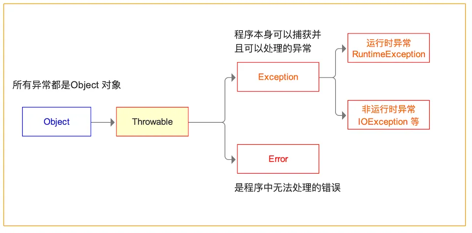
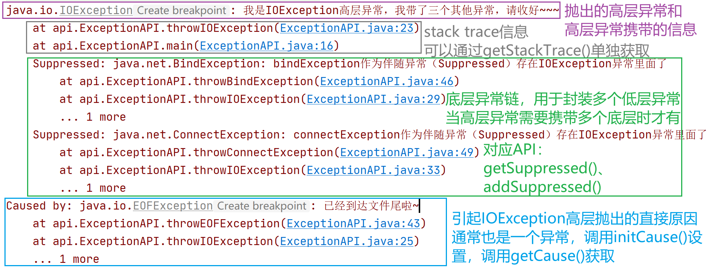
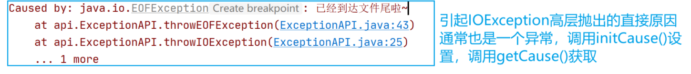
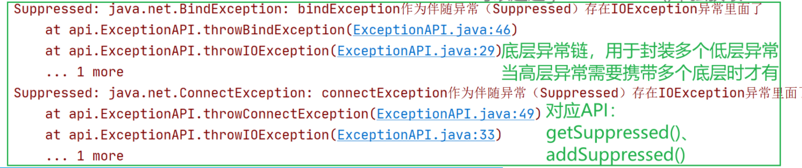

# Java异常（Exception）

这个分支尝试说明`Java`中的异常，并且在**不讲人话的基础上尽一切努力**。所以，如果听不懂，那：


另外文章比较长，后面可能有点小摆烂，**文章可能会有错误的地方，感谢指正。**

原文博客地址：[传送门](https://www.argentoaskia.cn/2022/07/11/Java/Java异常/#more)

喜欢的给个`star`吧，(●'◡'●)😘😘😘

------

## 什么是异常

在刚刚学习`Java`的时候，我很难去理解这个概念。认为只要我在写代码的时候留多个心眼，做个判断，理论上不就可以避免很多不必要的问题了吗！（比如，在使用对象之前判断一次对象是不是`null`不就行了？），但真正上手代码之后，发现，异常可以说是必不可少的东西。

那什么是异常呢？众所周知，一个程序如果能够符合我们预期这样执行下去，至少需要满足两个条件，**第一是编译通过，第二是程序在运行过程中没有出现逻辑错误。**第一层错误很好解决，编译器会告诉我们我们写的程序哪里有问题。**但是第二个条件想要发现就比较困难了，形如数组越界、除数为0这一类的逻辑错误，**很多时候必须要**在程序跑起来的时候才能发现**，并且一经发现，不得不终止程序。**这就要求程序代码运行时，必须要一种保护机制，这种机制能够在遇到这一类运行逻辑错误时及时告诉用户，并终止程序运行，现在我们可以称呼这种机制叫异常。**

那异常机制被触发的时候，要如何处理呢？这就涉及到另外一个概念，**叫异常捕获**。所谓异常捕获，是当程序抛出异常之后，我们将其拦截下来，并对该异常进行处理的过程（处理可以指弹出一个提示框告诉用户，也可以进行代码的修正等等）。

上面两个属于异常机制的基本特性，`Java`在异常机制的基础上做了扩展，开发者可以**二次抛出异常**，也叫**传递异常**。同时`Java`语言**内置了非常庞大的异常类体系**，一般以`XXXXException`作为类名。

## Java异常分类



### Throwable

所有异常都是由`Throwable`继承而来的，可以通过继承`Throwable`来实现新的异常，但是一般不推荐这样做，下一层分为了两个分支：`Error`和`Exception`

### Error

`Error`类用来描述`Java`运行时**系统内部引起的错误和资源消耗错误**，因为是`Java`内部的错误，一旦遇到，就与`Java`底层有关，程序代码无能为力，只能重启电脑或者重新安装`JDK`

### Exception

`Exception`类又可以分为`IOException`和`RuntimeException`，**开发者可以根据自己的需要继承该类来自定义一种新的异常类型。**

### RuntimeException

**运行时异常，也叫非检查型异常。（这个要记得，后面会考）**

一般程序应该通过检测的方式尽量避免`RuntimeException`（也就是说出现这种异常就是开发者自己的问题，**开发者一般无需要捕获这一类异常**，相反，应该使用代码`if(obj == null)`来检测避免出现`NullPointException`）

这种异常类型一般包括下面几个经典：

- 错误的（类型）强制类型转换：`ClassCastException`
- 数组访问越界：`ArrayIndexOutOfBoundsException`
- 访问`null`指针：`NullPointerException`
- ...

### IOException

**IO异常，也叫检查型异常。（这个要记得，后面会考）**

在实际中，**我们能够进行处理的只有检查型异常，因为检查型异常在我们个人的控制之内，非检查型异常对于任何的代码都有可能抛出，出现这些异常的时候我们没法控制。**

常见的`IOException`类包括：

- 文件末尾继续读取数据：`EOFException`

- 试图打开一个不存在的文件：`FileNotFoundException`

- 根据给定的字符串查找class对象，但是该类不存在：`ClassNotFoundException`

- ...


## 异常机制的使用

### 声明异常

声明异常可以参考下面的代码，异常只能在方法处进行声明，使用`throws`方法声明该方法可能抛出哪些**检查型异常**。**要注意，非检查型异常(**`RuntimeException`**及其子类)不需要声明。**

```java
public FileInputStream(String name) throws FileNotFoundException
```

若要声明多个**检查型异常**，**则需要用逗号分割**

```java
public Image loadImage(String name) throws FileNotFoundException, EOFException
```

那声明异常有什么作用呢？这就是之前说所的`Java`对异常机制的扩展，它的作用就是告诉其他方法，我这个方法当被调用的时候，可能会出现这两类逻辑错误，调用方要注意，至于调用方是直接捕获这两个异常还是把这两个异常传递出去，那就是另外的事情了。

### 什么时候需要声明异常

一般在下面两种情况下声明异常：

1. 方法本身需要抛出**检查型异常**（**非检查型不用，可以直接抛出**），就需要声明。

```java
public Image importFile(String name) throws FileNotFoundException{
	file f = readfile(name);
	if(f == null){
		throw new FileNotFoundException();	// 抛出异常
        return null;
	}
}
```

2. **调用一个抛出检查型异常的方法**，传递异常的时候。

```java
public Image loadNewImage(String name) throws FileNotFoundException, EOFException{
	importFile(name);
}
```

### 抛出异常

抛出异常的方法可以参考代码，主要涉及到`throw`（注意区分开`throw`和`throws`）

```java
// method 1:
throw new EOFException(); // 抛出一个EOFException

// method 2:
var a = new EOFException();
throw a;					// 抛出一个EOFException
```

抛出异常可以归纳为三个步骤：

1. 找到一个合适的异常类
2. 创建这一个异常类的对象
3. 将对象抛出

虽然前面稍微讲过，但是这里还是再提一次，因为异常有分**检查型异常**和**非检查型异常**两大类，他们的抛出方式也有所区别，**抛出检查型异常必须事先使用throws关键字在方法处进行声明**，如：

```java
// FileNotFoundException属于检查型异常
// importFile()方法抛出FileNotFoundException
public Image loadNewImage(String name) throws FileNotFoundException, EOFException{
	importFile(name);
}
```

**而抛出非检查型异常没有这个要求**，如：

```java
// ArrayIndexOutOfBoundsException属于非检查型异常
ublic void randomArrayMember(Object[] arrays, int index){
	if(arrays.length <= index){
		throw new ArrayIndexOutOfBoundsException();
	}
}
```

其次，**抛出非检查型异常一般意味着程序终止，而抛出检查型异常一般程序仍然在运行**。（当然**这并非绝对**，要看开发者如何处理异常，如进行异常包装等就不一定满足这个条件，这个后面再讲）

基于上面的这个条件，一般我们在带返回值的方法中，**抛出任何异常之后，不需要写**`return`**关键字，让我们抛出异常的时候，相当于跳出方法了，进入异常捕获代码段**，如：

```java
// 抛出非检查型异常的写法
public String importFile(String name) {
	file f = readfile(name);
	if(f == null){
		throw new RuntimeException();	// 抛出异常，之后方法就跳出去了
        // 不会运行到第六行。
        // 如果有finally代码块，则执行finally代码块
	}
    return “123123”;
}
```

### 捕获异常

在`Java`里面，要想处理（捕获）异常，需要使用`try...catch...finally...`语句，格式及运行顺序如下：

```java
try{
	// 先执行try里面的语句
	// 一旦try里面的有一条语句抛出ExceptionTypeX(X代表数字，都是ExceptionType的子类)类型异常，
    // 则进入相应的catch语句，哪怕try里面还有语句没执行完都要跳到catch里面去
}catch(ExceptionType1 e){
	// 在这里捕获异常，捕获到的异常信息，可以以弹框的形式提示给用户，也可以修正代码继续执行
}catch(ExceptionType2 e){
	// 可以存在多个catch，捕获多个异常
}catch(ExceptionType3 | ExceptionType4 e){
   	// JDK 1.7特性
    // 当捕获多个异常的时候，也可以这样写
	// 如果抛出的两个异常类是不同的，但是他们的处理方法都一样的话，还可以这样捕获
	// 注意这种方式捕获异常时，变量e被隐式声明为final，因此不能改变e的值
    // 注意当ExceptionType3是ExceptionType4的父类的时候，这种写法会报错，应该把子类异常先排在前面，父类异常排在后面，
    // 所以要改成ExceptionType4 | ExceptionType3，原因在于这个特性编译器终究会把它处理成这样的形式：
    /*
    	catch(ExceptionType3 e){}
    	catch(ExceptionType4 e){}
    */
 
}catch(ExceptionType e){
    // 当ExceptionType1、ExceptionType2、ExceptionType3、ExceptionType4都是ExceptionType的子类的时候
    // 还可以直接抛出高层异常，也叫父类异常，这种高层异常实际抛出有可能是上面四种子类异常中的其中一种
    // 抛出高层异常有非常大的好处，可以兼容复杂多样的异常子类，用户仅需要关注高层异常，
    // 并且通过高层异常的getMessage()方法获取异常机制提供给用户的逻辑错误信息，
    // 而无需通过具体的异常子类类型来判断出现了什么逻辑问题。
}finally{
	// 无论是否发生异常，最后都会运行此处的代码，通常用于释放资源
	// finally代码块可以省略
	// 注意不要把控制流的语句放在finally(return,throw,break,continue),会发生意想不到的错误
	// 同时也不应该过分依赖finally，一般的设计原则是将finally应用在关闭资源或者释放资源，如关闭IO流等
}
```

### 二次抛出异常（传递异常）

当我们调用了一个抛出**捕获型异常**的方法的时候，**如果我们不知道要怎么处理这个捕获型异常，那么原则上都需要把这个异常进行二次抛出**，将这个异常的最终处理权交给最后一个调用方。

如何二次抛出异常呢？就像抛出检查型异常那样，只需要在方法处声明异常即可，像下面这样：

```java
// FileNotFoundException属于检查型异常
// importFile(name)会抛出FileNotFoundException
public Image loadNewImage(String name) throws FileNotFoundException{
	importFile(name);
}
```

我们没有在`loadNewImage`方法里面抛出`FileNotFoundException`，这个异常由我们调用的`importFile(name)`方法抛出，当我们调用`loadNewImage()`方法，`loadNewImage()`方法里面的`importFile(name)`方法抛出`FileNotFoundException`之后，`loadNewImage()`方法**会将这个异常再次抛出**。

从`loadNewImage()`方法的调用方来看，`FileNotFoundException`像是从`loadNewImage()`方法中直接抛出的一样，但是`loadNewImage()`方法只是`FileNotFoundException`的搬运工，它并没有直接抛出这个异常，这个异常的产生来源自`importFile(name)`方法。

下面的代码可能更加直观的表示这种关系：

```java
public A() throws Exception {
	B();
}
public B() throws Exception {
	... // 处理代码
	if(...){
		throw new Exception();
	}
}

public fun(){
	try{
		A();
	}catch(Exception e){
	  // do something
	}
}
```

### 犹豫不决的问题：捕获异常还是传递异常

我们可以通过捕获异常来处理方法抛出的异常，但是并非每一个异常我们都知道怎么去处理。**异常要在适当的时候才去捕获。**

那么什么才算是适当的时候呢？这个问题没有答案。是的你没听过，**原则上只要你知道抛出来的异常要怎么解决，这个时候你才需要去捕获它，否则都应该把异常再次抛出去，让最后一个调用者来考虑如何处理异常。**

同时，由于方法内部可能调用了多个会抛出**检查型异常**的方法，`Java`异常也鼓励高层调用方**抛出高层统一的异常**，因此在传递异常时，可以传递异常的公共父类性，来达到抛出高层异常的需要，见下面的代码：

```java
// FileNotFoundException、EOFException都是IOException的子类，因此我们可以直接抛出父类异常来兼容这两种异常
public Image loadNewImage(String name) throws IOException{
	Image image = importFile(name);
	readByte(image);
    // 省略其他代码
}

public int readByte(Image image) throws EOFException{
	int codePoint = read0();
	if(codePoint == -1){
		throw new EOFException();
		return -1;
	}
	// 省略其他代码
}

public Image importFile(String name) throws FileNotFoundException{
	file f = readfile(name);
	if(f == null){
		throw new FileNotFoundException();	// 抛出异常
        return null;						// 带返回值
	}
	// 省略其他代码
}
```

在继承中，**检查型异常**的抛出也比较有意思。一般而言，如果父类的某个方法抛出了异常，则子类在重写这个方法的时候可以抛出相同的异常或是这个异常的具体子类，也可以选择不抛出异常，甚至抛出完全不一样的异常，如：

```java
public class ExceptionInheritedFather{
	public void test() throws IOException{
		// 省略其他代码
	}
}

class ExceptionInheritedSon1 extends ExceptionInheritedFather{
    // EOFException 是 IOException的子类
	@override
	public void test() throws EOFException{
		// 省略其他代码
	}
}

class ExceptionInheritedSon2 extends ExceptionInheritedFather{
   	// 子类也可以抛出相同的异常
	@override
	public void test() throws IOException{
		// 省略其他代码
	}
}
class ExceptionInheritedSon3 extends ExceptionInheritedFather{
    // 不抛出任何异常
    @override
	public void test() {
		// 省略其他代码
	}
}
class ExceptionInheritedSon4 extends ExceptionInheritedFather{
    // 抛出完全不相关的异常
    @override
	public void test() throws RuntimeException{
		// 省略其他代码
	}
}
```

## 自定义异常类

通常我们需要满足我们个人的一个程序需要的时候就需要自定义异常类，异常类的定义可以通过继承`Exception`类或者它的子类如`IOException`类或者`RuntimeException`类来完成

```java
public FileFormatException extends IOException{
	public FileFormatException(){
		super();
	}
	public FileFormatException(String message){
		super(message);
	}
    // JDK 1.4
	public FileFormatException(Throwable cause){
		super(cause);
	}
    // JDK 1.4
	public FileFormatException(String message, Throwable cause){
		super(message, cause);
	}
}
```

上面就是最基本的一个异常的定义，实际中，定义异常的时候，可以夹带一些对象或者私活，如：

```java
public FileFormatException extends IOException{
    private Date exceptionHappenTime;
	public FileFormatException(){
		super();
        exceptionHappenTime = new Date();
	}
	public FileFormatException(String message){
		super(message);
        exceptionHappenTime = new Date();
	}
	public FileFormatException(Throwable cause){
		super(cause);
        exceptionHappenTime = new Date();
	}
	public FileFormatException(String message, Throwable cause){
		super(message, cause);
        exceptionHappenTime = new Date();
	}
    public String getHappenTime(){
        SimpleDateFormat sdf = new SimpleDateFormat("yyyy-MM-dd hh:mm:ss");
        return sdf.format(exceptionHappenTime);
    }
}
```

当我们捕获了异常之后，我们可以获取异常发生的事件：

```java
public void formatFile(File file) throws FileFormatException{
	// 省略代码
	trow new FileFormatException();
}

public void format(String fileName){
	File f = new File(fileName);
	try{
		formatFile(f);
	}catch(FileFormatException e){
        // 获取异常发生事件
		System.out.println(e.getHappenTime())
	}
}
```

## 异常机制API及高级异常

### 异常机制API

之前我们曾经说过异常捕获的问题，当我们捕获一个异常的时候，要如何处理了，当时没有详细说，实际上在`Java`中，所有的异常类都有一套基本的`API`（你当然可以在这个的基础上进行扩展啦~），`API`列表如下：

```java
// 比较两个异常对象的引用（注意是引用）
public boolean equals(Object obj);
// 获取异常携带信息
public String getMessage();
public String getLocalizedMessage();
// 初始化低层异常、打印cause by内容
public Throwable initCause(Throwable cause);
public Throwable getCause();
// 添加异常链、打印Suppressed:内容
public final void addSuppressed(@NotNull Throwable exception);
public final Throwable[] getSuppressed();
// 获取栈调试信息
public StackTraceElement[] getStackTrace();
// 打印异常信息
public void printStackTrace();
public void printStackTrace(PrintStream s);
// 打印异常信息
public String toString();
```

就一般而言，**如果最后的调用者也不知道要如何处理这个异常，那就直接调用方法**`printStackTrace()`**即可**，这个方法会在`System.err`（控制台）输出红色的错误信息。具体代码如下：

```java
try {
    exceptionAPI.throwIOException();
} catch (IOException e) {
    e.printStackTrace();
}
```

如果你写了类似的代码，当抛出异常之后，你的控制可能会打印下面的类似于调试信息的东西。

```
java.io.IOException: 我是IOException高层异常，我带了三个其他异常，请收好~~~
	at api.ExceptionAPI.throwIOException(ExceptionAPI.java:23)
	at api.ExceptionAPI.main(ExceptionAPI.java:16)
	Suppressed: java.net.BindException: bindException作为伴随异常（Suppressed）存在IOException异常里面了
		at api.ExceptionAPI.throwBindException(ExceptionAPI.java:46)
		at api.ExceptionAPI.throwIOException(ExceptionAPI.java:29)
		... 1 more
	Suppressed: java.net.ConnectException: connectException作为伴随异常（Suppressed）存在IOException异常里面了
		at api.ExceptionAPI.throwConnectException(ExceptionAPI.java:49)
		at api.ExceptionAPI.throwIOException(ExceptionAPI.java:33)
		... 1 more
Caused by: java.io.EOFException: 已经到达文件尾啦~
	at api.ExceptionAPI.throwEOFException(ExceptionAPI.java:43)
	at api.ExceptionAPI.throwIOException(ExceptionAPI.java:25)
	... 1 more
```

上面的异常信息，各个部分是什么意思可以参考下面的图，现阶段，如果对异常链、`cause`异常不清楚的同学，无需担心，后面会讲，现在只需要有这样一个概念即可。



当然我们也可以分开获取对应的异常信息。具体的也会在接下来逐一介绍。

### 获取抛出异常信息

获取异常信息主要以下面两个`API`为主：

```java
// 获取异常携带信息
public String getMessage();
public String getLocalizedMessage();
```

当然这两个`API`获取到的信息并无差别，我们那上面图中的异常为例，`getMessage()`和`getLocalizedMessage()`获取到的都是一样的信息。

```java
try {
    exceptionAPI.throwIOException();
} catch (IOException e) {
    // 1.如果不知道需要干啥的，可以直接e.printStackTrace();
    // 2.输出异常信息
    String message = e.getMessage();
    String localizedMessage = e.getLocalizedMessage();
    System.out.println("message:" + message);
    System.out.println("localizedMessage:" + localizedMessage);
}
// 控制台输出：
// message:我是IOException高层异常，我带了三个其他异常，请收好~~~
// localizedMessage:我是IOException高层异常，我带了三个其他异常，请收好~~~
```

实际上在自定义异常的时候，子异常可以重写`getLocalizedMessage()`，以提供`getMessage()`之外的信息，一般用于描述这个自定义的异常是什么意思，何时会被抛出：

```java
public class NoSuchHandlerException extends IOException{
	public NoSuchHandlerException(){
		super();
	}
	public NoSuchHandlerException(String message){
		super(message);
	}
	public NoSuchHandlerException(Throwable cause){
		super(cause);
	}
	public NoSuchHandlerException(String message, Throwable cause){
		super(message, cause);
	}
	
	@Override
	public String getLocalizedMessage(){
		return "这个异常，用于指定DBUtils不存在这样的Handler的时候将会抛出，抛出这类异常请不要慌，请检查你的代码中是否有未注册的ResultSet处理器";
	}
}
```

当需要抛出高层异常或者统一异常的时候，**你也可以把底层异常的信息传递给高层异常**：

```java
try {
    exceptionAPI.throwIOException();
} catch (IOException e) {
    throw new Exception(e.getMessage());
}
```

### 异常嵌套中的捕获

先看下面的代码：

```java
InputStream i = ...;
try{
 ...	// code 1
 	try{
 		// code 2
 	}catch(Exception e){
 	
 	}finally{
 		i.close();	
 	}
}catch(IOException e){

}
```

若`finally`代码块中发生异常，则交由外层`IOException`捕获处理，若在`code 2`位置发生异常，交由内层`Exception`处理

### 二次抛出底层或另类异常

前面我们讲解过如何二次抛出异常，也说过当我们方法调用了多个将会产生异常的方法时，可以抛出这些异常的统一高层异常来避免一个方法抛出过多的异常，但大多数时候我们方法抛出的异常不可感知，体现在：

1. 方法内抛出的这多个异常，**分布广泛**，可能是扩展自`IOException`的类，甚至有些是继承`RuntimeException`的。

2. 还有一种情况是，当我们在方法中捕获到高层异常，你并不清楚这个高层异常的具体类型，**但现在需要你拿出具体的异常类型抛出**。

3. 甚至，有些时候，我们捕获到的异常和我们需要抛出去的**异常不存在父子关系**，这种情况一般常见于网络编程，如：我们方法需要抛出`SocketException`，但是我们在方法内调用的方法抛出了`EOFException`，这种情况可以通过初始化`cause`的方式来抛出，这是后话。

对于上面三种情况，我们可能需要二次抛出于之前调用方法异常毫无相关的异常，或者需要把高层异常解析，抛出具体的底层异常的，我们**可以先捕获，然后再抛出。**具体参考下面的代码：

```java
public void connection() throws ApplicationRunningException{
    // 针对情况3
    try{
        fun1();		// 可能抛出ArrayOutOfBoundsException
        fun2();		// 可能抛出SocketException
        fun3();		// 可能抛出EOFException
    }catch(IOException e){
        throw new ApplicationRunningException();	 
        // ApplicationRunningException自定义的异常，
        // 与ArrayOutOfBoundsException、SocketException、EOFException无关，
        // 但是你的方法又需要抛出ApplicationRunningException，这个时候可以采用这种方法。
    }
}
```

```java
// 针对情况2
public void connection() throws ApplicationRunningException{
    // 针对情况3
    try{
        fun1();		// 抛出高层异常IOException的方法，具体异常不详
    }catch(IOException e){
      // 其他处理代码
      String message = e.getMessage();
      throw new ApplicationRunningException(message);
    }
}
```

### 异常包装

我们在上一小节提及初始化`cause`这个东西，这里简单介绍，所谓`cause`是指，引发我这个异常被抛出的上一层异常。`cause`一般代表着最原始也是最重要的信息，特别在抛出高层异常中，这个高层异常很有可能是多个异常的集合体，如果需要告知具体是哪个异常引发的血案，有些时候可以不尝试抛出底层异常，而是尝试使用`cause`：

```java
public void connection() throws ApplicationRunningException{
    // 针对情况3
    try{
        fun1();		// 可能抛出ArrayOutOfBoundsException
        fun2();		// 可能抛出SocketException
        fun3();		// 可能抛出EOFException
    }catch(IOException e){
        throw new ApplicationRunningException(e);
    }
}
```

或者也可以这样写：

```java
public void connection() throws ApplicationRunningException{
    // 针对情况3
    try{
        fun1();		// 可能抛出ArrayOutOfBoundsException
        fun2();		// 可能抛出SocketException
        fun3();		// 可能抛出EOFException
    }catch(IOException e){
        ApplicationRunningException throwEx = new ApplicationRunningException();
        throwEx.initCause(e);
        throw throwEx;	 
    }
}
```

捕获异常时，使用

```java
Throwable original = e.getcause();
```

便可以获取引发高层的cause

对，没错，可能有同学已经猜到了，在异常信息底下的`cause by`就和现在介绍的`initCause()`有关。只不过`getCause()`帮你把它单独拿出来而已。



异常包装还是比较厉害的，你甚至能够包装高层异常或者是两个毫无关系的异常：

```java
public void connection() throws ApplicationRunningException{
    // 针对情况3
    try{
        fun1();		// 可能抛出IOException
    }catch(IOException e){
        ApplicationRunningException throwEx = new ApplicationRunningException();
        throwEx.initCause(e);
        throw throwEx;	 
    }
}
```

### 异常包装链和抑制异常

先看一段代码：

```java
public void func() throw IOException {
	byte[] fileBytes;
	// 其他代码
	try{
		InputStream in = new FileInputStream("D:\\test.txt");
		// 其他代码
	} catch(FileNotFoundException e){
		throw e;
	} finally{
		fileBytes = readAllBytes();
		try{
            in.close();
        }catch(IOException ex){
            throw ex;
        }
	}
}
```

上面的代码没有任何问题，但当`close()`方法抛出异常的时候，你没法直观判断`FileNotFoundException`到底有没有抛出。

因为如果代码先抛出`FileNotFoundException`进入`finally`代码块，`finally`代码块的`close()`方法再抛出异常，那现在抛出的`IOException`会盖过先前的`FileNotFoundException`。

为了解决这个问题，可以尝试异常抑制，那具体的异常抑制涉及到两个方法：

```java
public final void addSuppressed(@NotNull Throwable exception);
public final Throwable[] getSuppressed();
```

改进后的代码可以参考：

```java
// JDK 7新增异常抑制
public void func() throw IOException {
	byte[] fileBytes;
	FileNotFoundException fileNotFoundException;
	// 其他代码
	try{
		InputStream in = new FileInputStream("D:\\test.txt");
		// 其他代码
	} catch(FileNotFoundException e){
		fileNotFoundException = e;
		throw fileNotFoundException;
	} finally {
		fileBytes = readAllBytes();
		try{
            in.close();
        }catch(IOException ex){
           fileNotFoundException.addSuppressed(ex);
        }
	}
}
```

获取压制的异常，使用方法：

```java
public final Throwable[] getSuppressed();
```

对应下图的信息：



## 异常注意事项

### 在带finally的catch中使用return

需要注意在异常捕获语句中**使用return**，**finally块会被执行**，如下面代码：

```java
try {
    throwIOException();
} catch (IOException e) {
    e.printStackTrace();
    return "12313";
}finally {
    System.out.println("123123123123");
}
return "456456";
// 执行结果：
// e.printStackTrace();
// System.out.println("123123123123");
// return "12313";
```

当执行 `e.printStackTrace();`控制台打印异常信息，然后到`return "12313";`当执行完这语句之后，方法**实际上并没有完全返回**，而是去执行`finally`代码块的内容，执行`System.out.println("123123123123");`，最后才会返回方法调用处。

然后，当我们把`return "12313";`替换成`System.exit()`，此时程序将完全关闭。`finally`也自然不执行。

因此，**不建议在**`catch`**里面使用类似于**`return`，`break`**等流程控制关键字。**

## try-with-resource语句

该语句用于简化`try-catch-finally`语句中的释放工作

要使用`try-with-resource`语句，需要`res`实现`AutoCloseable`接口，该接口只有一个方法

```
void close() throws Exception
```

```
try(Resource res = ...){
	// work
}
```

使用`try-with-resource`，代码段在运行结束之后，无论是否有异常抛出，都会调用`res`中实现的`close()`。

一般情况下，**只要需要关闭资源，就要尽可能使用`try-with-resource`**

## Java中常见异常

1. `NullPointerException`：空指针异常。

2. `SQLException`：与数据库有关的异常，此为高层异常

3. `IndexOutOfBoundsException`：下标越界

4. `NumberFormatException`：数字格式化异常，如尝试将`abc`格式化成数字时就会出这个异常

5. `FileNotFoundException`：当试图打开指定路径名表示的文件失败时，抛出此异常。

6. `IOException`：当发生某种I/O异常时，抛出此异常。此类是失败或中断的I/O操作生成的异常的通用类。

7. `ClassCastException`：强制类型转换时，如果类型不对则抛出这个异常。

8. `ArrayStoreException`：试图将错误类型的对象存储到一个对象数组时抛出的异常。

9. `IllegalArgumentException`：参数传递不合法异常，如在不期望接收`null`的方法参数上传递`null`时可以选择抛出该异常。

10. `ArithmeticException`：当出现异常的运算条件时，抛出此异常。例如，一个整数“除以零”时，抛出此类的一个实例。

11. `NegativeArraySizeException`：如果应用程序试图创建大小为负的数组，则抛出该异常。

12. `NoSuchMethodException`：无法找到某一类中的特定方法时，抛出该异常，反射中见得比较多。
13. `NoSuchFiledException`：无法找到某一类中的特定字段时，抛出该异常，反射中见得比较多。
14. `SecurityException`：由安全管理器抛出的异常，指示存在安全侵犯。
15. `UnsupportedOperationException`：当不支持请求的操作时，抛出该异常。 
16. `RuntimeException`：是那些可能在Java虚拟机正常运行期间抛出的异常的超类。
17. `EOFException`：当程序在输入的过程中遇到文件或流的结尾时，引发异常。因此该异常用于检查是否达到文件或流的结尾。
18. `InterruptedException`：当某个线程处于长时间的等待、休眠或其他暂停状态，而此时其他的线程通过Thread的interrupt方法终止该线程时抛出该异常。
19. `CloneNotSupportedException`： 当没有实现`Cloneable`接口或者不支持克隆方法时,调用其`clone()`方法则抛出该异常。
20. `NoClassDefFoundException`：当`Java`虚拟机或者类装载器试图实例化某个类，而找不到该类的定义时抛出该错误。

## 2021.4.28 补充

### 捕获异常使用

在捕获异常时,**应该尽可能地对抛出异常那一条语句（调用）使用`try...catch`而不包含其他代码**，这样做的好处就是即便抛出了异常也能继续执行想要的代码，否则，过多地包含其他地代码会造成编码时的混乱，在程序变大的时候一旦出bug就非常难受了。**一句话，捕获异常需谨慎！**

## 2022.7.28补充

`Java`中无法创建泛型异常，下面的代码在`ide`中将会报错：

```java
public class HelloException<T> extends Exception{
	// 会报错，Java不支持泛型异常
}
```

## 参考

- 《`Java`核心技术卷一》
- [`Java7`的异常处理新特性-`addSuppressed()`方法等](https://www.cnblogs.com/langtianya/p/5139465.html)
- [`Java`常见的10个异常](https://www.cnblogs.com/jie-y/p/10775688.html)
- [`Java`中常见的异常（`Exception`）](https://blog.csdn.net/u011816231/article/details/50560751)

