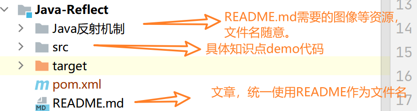

# JavaProject

`Java`知识点仓库，涵盖`Java`各方面的知识，主要会将`Java`分为三个层次进行介绍：

- `Java`基础（`base`）：包括一些通用语言基础、常用类、面向对象基础、`Java`语言基础、异常等。
- `Java`进阶（`advanced`）：一些`Java`特性，如`Java`反射、`Java`注解、`JavaIO`、多线程基础、`JDBC`、`Java`日志、`Java`网络编程、`JCF`等
- `Java`高级（`hard`）：包括`JVM`、类加载、字节码工程、`JUC`、手撕一些`JDK`源代码等。

另外除了这些之外，还会收录制作`JavaEE`技术相关的内容！

部分内容可能已经不适合当前时代，出于`Respect`或者更好的解释现代化技术，还是会简单介绍一下，这部分内容会再分支章节中的`README`做标记，如果急，很急，可以先跳过这部分内容。

喜欢的给个⭐吧o(*￣▽￣*)ブ。

## 😘阅读指南

所有的技术都会以分支的形式进行命名，格式为`序号-层次-技术点`，如：`1-advanced-reflect`代表是`Java`进阶反射技术，可以打开相对应的分支进行学习。

一般一个分支会包括一个`README.md`和一个或者多个`DEMO`，`README.md`用于辅助`Demo`和知识点的讲解，`Demo`为`maven`项目。

## 😘Demo运行

项目一个知识点一个分支的方式进行管理，在编写的时候采用`idea`多模块的方式，如果单单下载某个分支的`Demo`，可能需要修改一下`pom`文件，~~具体你可以在这里找到各个~~`pom`~~文件~~，~~替换掉从分支下载的~~`Demo`~~内自带的~~`pom`~~文件即可运行~~（由于工作量巨大暂时关闭）

## 😘关于PR提交、维护

如需要发`pull request`，请遵循下面两点即可。

1. 务必保证您的`demo`和`README.md`处在这样的文件结构。

2. 确保一个大分类知识点一个`branch`，如`JDBC`就可以作为单独一个分支、反射技术亦是如此，具体的知识点分类在下面。

## 知识点开填坑

若坑已填，则会出现对应的分支在知识点后面，尽量保证每个知识点之间没有太多关联。(\*/ω＼\*)

**其中带序号的就是大方向的知识点**，序号内不带序号的就是该知识点现阶段的具体内容。

- [ ] 1-入门上手

  - [ ] `JDK`安装
  - [ ] 第一个程序

- [ ] 2-通用语言基础

  - [ ] 基本数据类型、类型转换
  - [ ] 语句
  - [ ] 运算符VS表达式
  - [ ] 数组

- [ ] 3-面向对象基础
  - [ ] 类
  - [ ] 对象
  - [ ] OOP特性

- [ ] 4-面向对象在`Java`中应用
  - [ ] 方法权限级别
  - [ ] 类的声明
  - [ ] 方法的声明
  - [ ] 字段声明
  - [ ] 对象创建
  - [ ] 继承

- [ ] 5-面向对象在`Java`中应用（高阶）
  - [ ] 内部类
    - [ ] 静态内部类
    - [ ] 普通内部类
    - [ ] 内部类原理
  - [ ] 匿名类
  - [ ] 静态代码块
  - [ ] 构造代码块
  - [ ] 接口
  - [ ] 抽象类

- [ ] 6-关键字（复习）
  - [ ] final
  - [ ] static
  - [ ] new
  - [ ] this
  - [ ] super

- [ ] 7-包概念
  - [ ] `package`
  - [ ] `import`
  - [ ] `classpath`

- [x] 8-常用工具类
  - [x] 数学处理：`RandomUtil`、`UUIDUtil`
  - [x] 包装器类
  - [x] 字符串处理
  - [x] 时间类（旧`API`）
  - [x] 格式化类

- [x] 9-`Java`异常：[10-java-base-exception](https://github.com/ArgentoAskia/JavaProject/tree/9-base-exception)

  - [x] `2022.7.28`更新：`Java`不支持创建泛型异常

- [ ] 10-`Java`泛型使用

- [ ] 11-`Java`注解使用

- [ ] 12-`Java`集合容器（`JCF`）

  - [ ] Guava
  - [ ] Eclipse-Collections

- [ ] 13-`Java`随机文件读写

- [x] 14-第一第二代图形化（`AWT`、`Swing`）
  - [x] AWT组件库：2023.1.8、2023.1.9、2023.1.10、2023.1.12、2023.1.15

  ------------------------------------------ 基础知识点完毕 --------------------------------------------

- [ ] 1-`Java`反射技术

  - [x] 反射简介来源
  - [x] `JDK`版本迭代中的反射`API`
    - [x] `Class`：2023.1.30
    - [x] `Field`
    - [x] `Array`
    - [x] `Method`
  - [ ] 反射应用场景

- [ ] 2-`Java`泛型原理补充

  - [ ] 类型擦除
  - [ ] `Java`泛型注意事项

- [ ] 3-`Java`注解高阶

  - [ ] 如何声明注解
  - [ ] 元注解
  - [ ] 注解处理器
  - [ ] 注解实现原理

- [ ] 4-`Java`内置设计模式实现

  - [x] 动态代理模式：2023.1.21
  - [x] 观察者模式：2023.1.20

- [ ] 5-`Java-IO`

  - [ ] `Java-IO`家族及应用
    - [x] `AudioInputStream`: unknown
    - [x] `BufferedInputStream`: unknown
    - [x] `BufferedOutputStream`: 2023.1.25
    - [x] `ByteArrayInputStream`:unknown
    - [x] `ByteArrayOutputStream`: 2023.1.21、2023.1.22
    - [x] `checkedInputStream`: unknown
    - [x] `CipherInputStream`: 2023.1.12
    - [x] `CipherOutputStream`: 2023.1.12
    - [x] `DataInputStream`: 2023.1.13
    - [x] `DataOutputStream`: 2023.1.13
    - [x] `DigestInputStream`: 2023.1.16、2023.1.17
    - [x] `DigestOutputStream`: 2023.1.16、2023.1.17
    - [ ] `GZipInputStream`: 2023.1.18
    - [x] `GZipOutputStream`: 2023.1.18
  - [ ] 字节流字符流转换
  - [ ] 序列化VS反序列化
  - [x] IO工具类 2023.1.6、2023.1.7

- [ ] 6-`Java`语法糖及常见接口

  - [ ] 实现`foreach`循环
  - [ ] 实现`try...with...resources`
  - [ ] 实现对象拷贝
    - [ ] 浅拷贝
    - [ ] 深拷贝
  - [ ] 实现对象比较
    - [ ] Comparable
    - [ ] Comparator

- [ ] 7-`Java`多线程基础

  - [ ] 线程创建
  - [ ] 并发`concurrent`包

- [ ] 8-`Java`文件操作

  - [ ] 基础文件操作（创建文件、创建目录等等）：2023.1.25
  - [ ] `XML`：2023.1.25、2023.2.2
  - [ ] `PDF`、`Word`、`md`、`json`、二维码等文件处理
  - [ ] 文件系统

- [ ] 9-`Java`高阶图形化介绍

  - [ ] `JavaFX`
  - [ ] `SWT`

- [ ] 10-`Java Stream`

- [x] 11-`JDBC`

  - [x] `java.sql.*`
    - [x] `OracleJDBC连接`
    - [x] `MySqlJDBC连接`
    - [x] `JDBC-MetaData`
  - [x] `javax.sql.*`（连接池）
    - [x] `C3P0DataSource`
    - [x] `DruidDataSource`
    - [x] `hikariCPDataSource`
    - [x] `MySqlDataSource`
  - [ ] `light ORM Framework`
    - [ ] `dbUtils`
      - [x] `SimpleDemo`:2023.1.15
      - [ ] `handlers`
    - [ ] `spring-jdbc`
      - [ ] `JdbcTemplate`

- [ ] 12-`Java`网络编程

  - [ ] `BIO`
  - [ ] `NIO`
  - [ ] `AIO`
  - [ ] `HTTPClient`
  - [ ] `netty`

- [ ] 13-函数式编程

  - [ ] `lambda`
  - [ ] `function`包

- [ ] 14-时间`API`

- [ ] 15-国际化编程

- [ ] 16-模块化编程

- [ ] 17-日志框架

- [ ] 18-编译器、脚本`API`

- [ ] 19-`JNI`

- [ ] 20-平台安全

- [ ] 21-媒体图像处理

- [ ] 22-`RMI`

## 更新日志

- 2023.02.03 - 添加获取节点Demo

- 2023.02.03 - 更新XML笔记

----

- 2023.02.02 - 更新XML笔记

------

- 2023.01.30 - 更新反射API笔记

-------

- 2023.01.25 - 梳理Dom API

- 2023.01.25 - 创建XML解析Demo模块

- 2023.01.25 - 随机数工具类添加randomAlphabet()、randomAlphabetNumber()、randomSingleDigit()方法

- 2023.01.25 - 更新BufferedOutputStreamDemo的基本使用。

-------

- 2023.01.22 - 更新ByteArrayOutputStream的Size()、Reset()、toXXX()等

-------

- 2023.01.21 - 更新JDK动态代理模式实现

- 2023.01.21 - 更新ByteArrayOutputStream基本Write功能

--------

- 2023.01.20 - 更新JDK观察者模式实现

--------

- 2023.01.18 - 更新GZipInputStreamDemo和GZipOutputStreamDemo 

--------

- 2023.01.17 - 分类好外部资源，防止混乱

- 2023.01.17 - 重写DigestInputStreamDemo和DigestOutputStreamDemo，模拟文件校验过程

- 2023.01.17 - 修改资源文件路径

-----------

- 2023.01.16 - 更新DigestInputStream和DigestOutputStream的Demo

----------------------

- 2023.01.15 - 更新JDBC笔记

- 2023.01.15 - 重写JDBC知识点体系

- 2023.01.15 - 添加dbUtils笔记

- 2023.01.15 - 更新AWT笔记

- 2023.01.15 - 解决dbUtils框架Bean无法映射的问题

-----

- 2023.01.12 - 添加AWT常用组件说明

-----

- 2023.01.10 - 更新AWT组件笔记

- 2023.01.10 - 整理AWT知识点分类

------

- 2023.01.07 - 更新AWT

-------

- 2023.01.06 - 更新AWT

- 2023.01.06 - IO工具类

