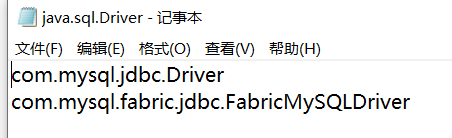

## JDBC快速入门

## 概念

概念：`Java DataBase Connectivity  Java` 数据库连接， Java语言操作数据库。

 JDBC本质：其实是官方（sun公司）定义的一套操作所有关系型数据库的规则，即接口。各个数据库厂商去实现这套接口，提供数据库驱动jar包。我们可以使用这套接口（JDBC）编程，真正执行的代码是驱动jar包中的实现类。

常见的数据库对应的驱动包名：

- `mysql`：
  - `mysql-connector-java-[版本].jar`
- `Oracle`：
  - `ojdbc8.jar（kernel）`：连接核心，兼容 `JDK8`, `JDK11`, `JDK12`, `JDK13`, `JDK14`和`JDK15`
  - `ons.jar`：TNS连接方式
  - `orai18n.jar`：语言locate包
  - `oraclepki.jar`：`oracle PKI API`
  - `osdt_cert.jar`：`Certificate management components used for Oracle Wallets`
  - `osdt_core.jar`：`Core components for use with osdt_cert`
  - `rsi.jar`：`A dedicated path for ingesting high volume of data into Oracle database`
  - `simplefan.jar`：`Simple Fast Application Notification (FAN) library`
  - `ucp.jar`：`Oracle Universal Connection Pool (UCP)`
  - `xdb.jar`：`Support for the JDBC 4.x standard java.sql.SQLXML interface`
  - `xmlparserv2.jar`：`The Oracle Database XML Parser library`
- `MS Server`：
  - `mssql-jdbc-[版本].jar`
  - `sqlserver-win-auth.jar`

需要注意的是，像`Oracle`数据库的话，不像`mysql`这样一个包即可打天下，可能需要很多包，并且Oracle的核心驱动包也有很多版本，在`maven`上最早的能追溯到2005年，如：ojddbc8、ojdbc10等。

但是理论上只要导入核心的包就可以用。

## 上手步骤

1. 准备驱动包：
2. 注册驱动：
3. 获取数据库连接对象（`Connection`）
4. 定义`SQL`
5. 获取`Statement`
6. 执行`SQL`，返回并处理结果
7. 释放资源

### 完整代码

 参考`src/main/java/demo/jdbc/MySQLJDBCDemo.java`和`src/main/java/demo/jdbc/OracleJDBCDemo.java`

注意连接`Oracle`数据库的时候，除了需要导入`ojdbc8.jar`之外，可能还需要导入`locate`包`orai18n.jar`

## JDBC主要类解释

### DriverManager类

这个类主要处理两部分内容：**注册驱动和获取数据库连接**

#### 注册驱动

注册驱动涉及到的方法是：

```java
// 注册与给定的驱动程序 DriverManager 。
public static void registerDriver(Driver driver)
```

因此实际上注册驱动的写法是这样的：

```java
DriverManager.registerDriver(new Driver());
```

但是我们在编程的时候使用的是加载`Driver`类（`Class.forName()`）来进行驱动注册，原因是加载`Driver`类的时候，会触发`Driver`类中的静态代码块：

```java
static {
	try {
		java.sql.DriverManager.registerDriver(new Driver());
	} catch (SQLException E) {
		throw new RuntimeException("Can't register driver!");
	}
}
```

`mysql5`之后的驱动`jar`包可以**省略注册驱动**的步骤，原因是`mysql5`可以通过扫描`META-INF\services\java.sql.Driver`配置文件，读取里面的内容进行加载驱动，内容如下：



#### 获取数据库连接

获取连接常用的方法是：

```java
public static Connection getConnection(String url, String user, String password)
```

- `url`：指定连接的路径
  - 语法：`jdbc:mysql://ip地址(域名):端口号/数据库名称`
    - 例子：`jdbc:mysql://localhost:3306/db3`
    - 细节：如果连接的是本机`mysql`服务器，并且`mysql`服务默认端口是`3306`，则`url`可以简写为：`jdbc:mysql:///数据库名称`
- `user`：用户名
- `password`：密码 

### Connection类

`Connection`类的功能有两个：执行`sql`的对象（`Statement`和`PreparedStatement`）和事务管理

可以使用下面两个方法获取执行`sql`的对象：

* `Statement createStatement()`
*  `PreparedStatement prepareStatement(String sql)` 

#### 事务管理

事务就是相当于一组同步的操作，这些操作要么全都完成，要么全都不做。相当于一个原子的步骤。

- `setAutoCommit(boolean autoCommit)` ：调用该方法设置参数为`false`，即开启事务，默认为`true`，也就是自动提交修改

- 提交事务：`commit()` 
- 回滚事务：`rollback()`

##### 案例

如果你想知道事务管理要用在哪个地方上面，下面这段代码可以帮到你：

```java
/**
 * 事务操作
 * 见于支付系统转账等情况
 * 张三给李四转账500块钱
 */
public class JDBCDemo10 {


    public static void main(String[] args) {
        Connection conn = null;
        PreparedStatement pstmt1 = null;
        PreparedStatement pstmt2 = null;

        try {
            //1.获取连接
            conn = JDBCUtils.getConnection();
            //开启事务
            conn.setAutoCommit(false);
           
            //2.定义sql
            //2.1 张三 - 500
            String sql1 = "update account set balance = balance - ? where id = ?";
            //2.2 李四 + 500
            String sql2 = "update account set balance = balance + ? where id = ?";
            
            //3.获取执行sql对象
            pstmt1 = conn.prepareStatement(sql1);
            pstmt2 = conn.prepareStatement(sql2);
            
            //4. 设置参数
            pstmt1.setDouble(1,500);
            pstmt1.setInt(2,1);
            pstmt2.setDouble(1,500);
            pstmt2.setInt(2,2);
            
            //5.执行sql
            pstmt1.executeUpdate();
            // 手动制造异常
            int i = 3/0;
            
            // 出现异常下面的代码都不执行，直接跳到catch
            pstmt2.executeUpdate();
            // 提交事务
            conn.commit();
        } catch (Exception e) {
            // 因为有异常，而且事务的步骤还没执行完，就需要回滚事务
            try {
                if(conn != null) {
                    conn.rollback();
                }
            } catch (SQLException e1) {
                e1.printStackTrace();
            }
            e.printStackTrace();
        }finally {
            JDBCUtils.close(pstmt1,conn);
            JDBCUtils.close(pstmt2,null);
        }
    }
}
```

### Statement类

执行静态`sql`语句

- `boolean execute(String sql)` ：可以执行任意的`sql`了解 
- `int executeUpdate(String sql)` ：执行`DML`（`insert、update、delete`）语句（常用）、`DDL`(`create，alter、drop`)语句（不常用）
  - 返回值：影响的行数，可以通过这个影响的行数判断`DML`语句是否执行成功 返回值`>0`的则执行成功，反之，则失败。
- `ResultSet executeQuery(String sql)`  ：执行`DQL`（`select`)语句

### PreparedStatement类

`PreparedStatement`为解决`SQL`注入问题而提出，是`Statement`的子类，执行允许预编译`SQL`来实现动态`SQL`，参数用？作为占位符，并且通过`setXXX()`来填充？参数

```java
PreparedStatement ps = Connection.prepareStatement(String sql) 
ps.setString()
ps.setInt()
...
```

### ResultSet结果集类

结果集类通常是`executeQuery()`方法的返回值。用于`select`语句

- `boolean next()`: 游标向下移动一行，判断当前行是否是最后一行末尾(是否有数据)，如果是，则返回`false`，如果不是则返回`true`
- `getXxx(参数)`:获取数据
  `Xxx`：代表数据类型   如： `int getInt()` ,	`String getString()`
  - 参数：一般`GetXxx()`方法都有两类重载体系：`int`参数和`String`参数
    - `int`：代表列的编号，从`1`开始   如：`getString(1)`
    - `String`：代表列名称。 如：`getDouble("balance")`

返回的结果集和迭代器一样，指针置于第一个元素之前，因此想要获取第一个结果，需要先调用`next()`，可以参考下面代码的写法：

```java
ResultSet rs = ...;
while(rs.next()){
	int id = rs.getInt(1);
	String name = rs.getString("name");
	double balance = rs.getDouble(3);
	System.out.println(id + "---" + name + "---" + balance);
}
```

### CallableStatement类

该类用于执行存储过程。对于储存过程中`IN`、`OUT`、`INOUT`类型的参数，有如下处理：

| 参数  | 描述                                                         |
| ----- | ------------------------------------------------------------ |
| IN    | 创建SQL语句时其值未知的参数。使用setXXX()方法将值传递给IN参数。 |
| OUT   | 从SQL语句返回其值的参数。需要先调用registerOutParameter()进行出参注册，然后使用getXXX()方法从OUT参数中获取值。 |
| INOUT | 参数可以传入和传出值。需要先调用registerOutParameter()进行出参注册，用setXXX()方法绑定变量，并用getXXX()方法检索值。 |

首先使用`Connection.prepareCall()`实例化一个`CallableStatement`对象

```java
String strSQL = "{call getEmpName (?, ?)}";	// {}可以省略
cstmt = conn.prepareCall (SQL);
```

`getEmpName (?, ?)`储存过程第一个参数是`String`入参，第二个参数是`Integer`出参，因此需要这样做：

```java
cstmt.setString(1, "Apple");
cstmt.registerOutParameter(2, Types.INTEGER);
ResultSet rs = cstmt.executeQuery();
...
int i = cstmt.getInt(2);
System.out.println(i);
```

