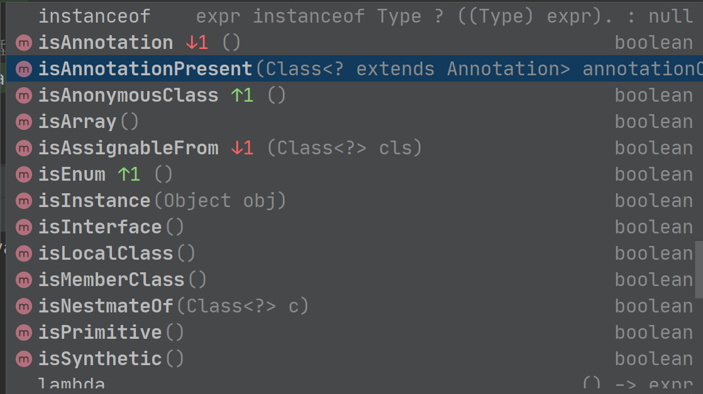
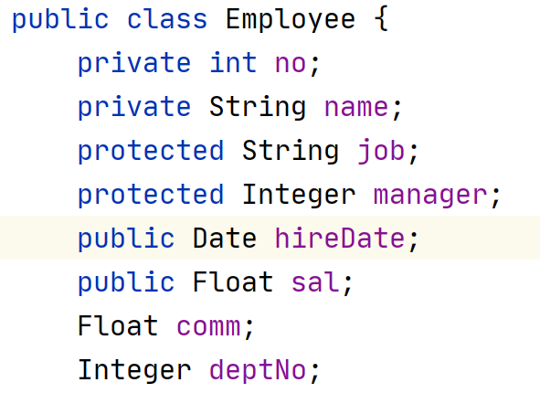
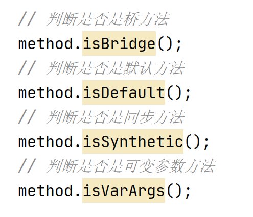
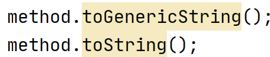

## 简介

写这篇文章的时候我才大二，如今看回来很多东西都已经物是人非了，这篇文章拖拖沓沓地过了两年了，很久之前就想快点写完，但是`Java`的反射技术`Api`真的多，从20年疫情开始拖到了现在都没写完。

回看以前的文笔真的感觉好幼稚啊(✿◡‿◡)！

## 关于反射

能够分析一个类的能力的技术称之为反射(`Reflection`)，反射机制在`Java`里面算比较有意思的，但是除非要制作一些个人的工具包，否则可以跳过反射技术的学习。

所谓分析一个类的能力，指代的是当我们`new`出一个对象之后，我们可以通过对象得知它由哪个类创建而来，并且这个类有哪些父类，哪些方法，字段和注解等等，这些信息能够帮助我们处理一些特殊的事情。

实际上很多框架底层的方法都离不开反射技术，因为需要在对象运行时得到这些类的信息并且进行处理，所以反射技术一般的运用都是在制作一些工具上，一般而言，反射可以用来：

1. 在运行时分析类的能力
2. 在运行时检查对象，例如：编写一个适合所有类的`toString()`
3. 实现泛型数组操作代码
4. 利用Method对象（类似C++中的函数指针）
5. 用户界面生成器

## Java反射体系


`Java`的反射体系主要由这些类构成：

- `Field`：代表类的某个字段
- `Constructor`：代表类的某个构造器
- `Method`：代表类的某个方法
- `Class`：代表某个类的定义内容
- `Parameter`：代表方法上的参数
- `Array`：一个工具类，一般用来创建动态数组
- `Modifier`：工具类，代表修饰符，通过这个工具类可以知道类、方法、字段上有哪些修饰符，所谓修饰符是`public`、`static`、`final`等。

另外，`JDK5`引入了`Type`接口，到`JDK8`的时候对`Type`接口进行了大量更新，构成一整套`Type`类型系统，以增强对泛型的支持，`JDK8`同时还引入`AnnotatedType`接口，用于代表所有可被注解标记的类型，方便用于单独处理注解。

下面是整套`Type`系统和`AnnotatedType`接口系统的简单介绍：

- `Type`接口：代表`Java`中的任何被`JVM`支持的类型，包括泛型，其中泛型类型被分成了下面四个子接口来处理：
  - `TypeVariable`：泛型参数，如`List<T>`中的`T`，`Map<K,V>`中的`K`、`V`
  - `WildcardType`：通配符类型，即任何带`?`的泛型，`List<?>`，`Set<? extends Number>`
  - `GenericArrayType`：泛型数组类型，如：`List<T>[]`、`T[]`、`Map<String, Integer>[]`
  - `ParameterizedType`：参数化类型，即任何带泛型的类型，不管是否带泛型参数如：`List<T>`,`Map<Integer,String>`等。
- `AnnotatedType`接口
  - `AnnotatedArrayType`
  - `AnnotatedParameterizedType`
  - `AnnotatedTypeVariable`
  - `AnnotatedWildcardType`

以上便是`Java`反射体系中的核心内容的划分，文章以`Type`系统为分割，划分为两大部分来讲解：

- 基础反射类库：主要讲解一些反射体系核心类如`Field`、`Constructor`等`API`，旨在说明反射能够干什么，并且会探讨这些`API`设计时的一些习惯和顾虑等。
- 反射类型系统：主要介绍`Type`、`AnnotatedType`接口及其子接口

文章较长，大家可以挑着来看。

## 基础反射类

### Class类

在程序运行时，JRE始终为所有对象维护一个运行时类型标识~~（个人猜测实际上是一个结构体）~~。**这个类型标识会跟踪记录每一个对象所属的类**。虚拟机利用这些信息来保证调用正确的方法

`Class`类保存了**这<span style="background-color:yellow">些</span>类型标识**（`Class`类是**泛型类**）内部的信息，因此可以使用这个特殊的类来访问这些信息。

#### 获取对象或者类的Class信息

Object类中有一个`getClass()`，可以返回一个`Class`类型实例

```java
class cl = e.getclass();
```

`class`类中有个方法`getName()`，可以获取对象所属的类名（字符串形式），当然如果这个类在一个包中，则返回的类名也会包含包名。

```java
var ram = new Random();
Class cl = ram.getClass();
String name = cl.getName()  
// name is "java.util.Random"
```

当然java还有一种方便的方法来获取每一个类的`Class`类对象。**如果`T`是任意的Java类型，则`T.class`代表该类的`Class`类对象**

```
Class cl = Random.class;
Class c2 = int[].class;
Class c3 = int.class;		
```

**Class对象实际上表示的是一种类型（type），这种类型可以是类，亦可以不是类，因此`int.class、int[].class`是合法的。**

如果我想实现动态加载加载类，或者我现在知道这个类的类名（或者接口名）,则还可以使用`Class`类本身的静态方法来实现类加载

```
String classname = "java.util.Random";
try{
	Class cl = Class.forName(classname);
}catch(Exception e){
	e.printStackTrace();
}

```

若`classname`不是一个接口或者类，则会抛出检查型异常。因此捕获异常。

使用这种方法获得`Class`对象，`classname`对应的类会被加载，**也就是说类里面的静态代码块（Static Code）会被执行**。同时可以变换`classname`的值来实现动态加载类。

#### 更加准确的类型比较

`JVM`为每一种类型维护一个唯一的`Class`对象，也就是说父类和子类被区分为不同的`Class`类型，因此可以利用`==`来进行同类型对象比较

```
father.getClass() == son.getClass();	// 表达式为False，即便father对象对应的类是son对象对应的类的父类
```

#### 使用Class类对象构造实例

前文说过，`Class`类实际上表示的是一种类型，既然如此我能不能用一个`Class`类来构造一个类实例呢？

使用`getConstructor()`和`newInstance()`

```java
String classname = "cn.argentoaskia.demo.beans.Employee";
Class cl = Class.forName(classname);
Object obj = Cl.getConstructor().newInstance();
```

实际上`Class`类的对象也有直接的`newInstance()`方法，效果和上面的代码差不多。

那如果我想要调用有参数的构造器来创建对象呢？

先看看`getConstructor()`和`newInstance()`方法的声明：

```java
Constructor getConstructor(Class ...paramterTypes)		// 生成一个构造器对象,并描述这个构造器有什么参数类型
Object newInstance(Object ...params)					// 生成对象实例，params参数为构造器传进的参数
```

因此，可以

```java
Class cl = Class.forName(classname);
Object obj = Cl.getConstructor(int.class).newInstance(25);		// 调用classname类中带int类型的构造器，并传入参数整型25
```

#### 运行时获取类的类名

`Class`对象中获取类名的方法有4个：

```java
clazz.getName();
clazz.getSimpleName();
clazz.getCanonicalName();
clazz.getTypeName();
```

这四个方法的区别于`clazz`对象是数组、内部类等。通常：

##### getName()

`getName()`可以获取类、接口、枚举、内部类、注解、数组、基本类型甚至`void`的全限定类名。

**如果获取的对象是一个类对象、接口实现对象，则返回的是一个全限定类名，如：**

```java
Double.class.getName();
// java.lang.Double
ActionListener.class.getName();
// java.awt.event.ActionListener
SafeVarargs.class.getName();
// java.lang.SafeVarargs
```

**如果该类对象是一个内部的类，无论是内部的枚举、内部接口，返回的类名都是**`主类$内部类`**的格式，如对于类：**

```java
package tech.argentoaskia.utils;
public class FileUtilsTest {

    public static class utils<T extends Object, E extends Object>{

    }
}
```

```java
utils.class.getName();
// tech.argentoaskia.utils.FileUtilsTest$utils
```

**如果类型是一个基本类型或者`void`，则返回该关键字的字符串名称：**

```java
int.class.getName();
// int
void.class.getName();
// void
```

**如果类型是一个数组类型，则返回`[`+标记字符的形式**，**其中[的个数代表维度**，`Java`中的标记字符参考下表：

| 类型               | 标记字符      |
| ------------------ | ------------- |
| boolean            | Z             |
| byte               | B             |
| char               | C             |
| double             | D             |
| float              | F             |
| int                | I             |
| long               | J             |
| short              | S             |
| class or interface | L`classname`; |

```java
Double[].class.getName();
// [Ljava.lang.Double
Double[][].class.getName();
// [[Ljava.lang.Double
int[].class.getName();
// [I
int[][].class.getName();
// [[I
```

##### getSimpleName()

```shell
Returns the simple name of the underlying class as given in the source code. Returns an empty string if the underlying class is anonymous.
The simple name of an array is the simple name of the component type with "[]" appended. In particular the simple name of an array whose component type is anonymous is "[]".
```

该方法返回一个简单类型，如：

```java
Double.class.getSimpleName();
// Double
ActionListener.class.getSimpleName();
// ActionListener
SafeVarargs.class.getSimpleName();
// SafeVarargs
```

如果是一个匿名类，则返回空字符串。

```java
ActionListener actionListener = new ActionListener() {
            @Override
            public void actionPerformed(ActionEvent e) {
                String simpleName = this.getClass().getSimpleName();
                System.out.println("输出空字符串：" + simpleName);
            }
        };
actionListener.actionPerformed(null);
// 输出空字符串：
```

如果是数组：

```java
Double[].class.getSimpleName();
// Double[]
```

##### getCanonicalName()

```
Returns the canonical name of the underlying class as defined by the Java Language Specification. Returns null if the underlying class does not have a canonical name (i.e., if it is a local or anonymous class（匿名类） or an array whose component type does not have a canonical name).
```

在面对一个类型的时候，直接输出，在面对内部类的时候，不使用$

```java
// 引用数组类型
Class<Integer[]> intsClass = Integer[].class;
// 内部类
Class<utils> utilsClass = utils.class;
// 基本类型数组
Class<int[]> aClass = int[].class;
// 引用类型
Class<Integer> integerClass = Integer.class;
// 注解类型
Class<customAnnotatedType> customAnnotatedTypeClass = customAnnotatedType.class;
// 基本类型
Class<Integer> integerClass1 = int.class;

// 引用数组类型:java.lang.Integer[]
System.out.println(intsClass.getCanonicalName());

// 注意区别与getName的tech.argentoaskia.utils.FileUtilsTest$utils
// 内部类:tech.argentoaskia.utils.FileUtilsTest.utils
System.out.println(utilsClass.getCanonicalName());
// 基本类型数组:int[]
System.out.println(aClass.getCanonicalName());

// 引用类型：java.lang.Integer
System.out.println(integerClass.getCanonicalName());
// 注解类型：tech.argentoaskia.utils.customAnnotatedType
System.out.println(customAnnotatedTypeClass.getCanonicalName());

// 基本类型：int
System.out.println(integerClass1.getCanonicalName());
```

##### getTypeName()

该方法可以说在数组上采用`getCanonicalName()` 的返回值，在内部类（即返回带`$`符号的）、枚举、普通类、接口、基本类型等，采用`getName()`的方式。

#### 获取数组去掉维度后的类名

```java
// 获取数组代表的类型
public Class<?> getComponentType()
```

```java
Class<Integer[]> intsClass = Integer[].class;
System.out.println(intsClass.getComponentType().getName()); 
// java.lang.Integer
```

#### 获取类所在的包名

```java
public String getPackageName();		// JDK 9
```

```java
Class<Integer[]> intsClass = Integer[].class;
System.out.println(intsClass.getPackageName()); 
// java.lang.Integer --> java.lang
```

**注意对于基本类型，返回的是`java.lang`**

**数组则返回原始类型所在的包，如上面的代码**

**如果是成员类（匿名类、内部类等），则返回闭源类（也就是匿名类、内部类所在的类）所在的类的包**

**如果一个类不属于任何包（也就是没有`package`关键字），则返回空字符串**

获取类的包名的还有一种方式，通过`getPackage()`拿到`Pakcage`对象，然后使用`getName()`方法。

```java
// cn.argentoaskia.demo.beans.Employee
Employee employee = new Employee();
Class<? extends Employee> employeeClass = employee.getClass();
String name = employeeClassByStr.getPackage().getName();
System.out.println(name);
// 输出：cn.argentoaskia.demo.beans
```

但是这样的方式在面对基本类型、数组（无论是基本类型的数组还是引用类型的数组）的时候都会抛出`NPE`。

#### 获取一个类的所有内部成员类或者接口

```java
public Class<?>[] getClasses();
public Class<?>[] getDeclaredClasses();
public Class<?>[] getNestMembers();	// jdk11
```

`getClasses()`将会返回所有的`public`的内部成员类或者接口，如果你的类存在继承关系，则父类的所有`Public`的内部成员类和接口也会被显示出来，如果是基本类型、数组、`void`默认返回`0`成员数组。

`getDeclaredClasses()`将会返回所有的内部成员类或者接口，不管是怎样的修饰符（`private`、`public`等）。但是，不包含父类的内部成员类和接口，如果是基本类型、数组、`void`默认返回`0`成员数组。

因为`getDeclaredClasses()`这个特性，在处理匿名类的时候，将不会显示匿名类原本的方法，参考`cn.argentoaskia.demo.ClassDemo`中的`7.1`

`getNestMembers()`将会返回所有的内部成员，**包括匿名类和它自身**，其中匿名内部类，**采用数字标注的形式**，参考下面的输出倒数三行

```java
[class tech.argentoaskia.utils.FileUtilsTest, 
 class tech.argentoaskia.utils.FileUtilsTest$constains, 
 class tech.argentoaskia.utils.FileUtilsTest$utils2, 
 class tech.argentoaskia.utils.FileUtilsTest$utils, 
 class tech.argentoaskia.utils.FileUtilsTest$3, 
 class tech.argentoaskia.utils.FileUtilsTest$2, 
 class tech.argentoaskia.utils.FileUtilsTest$1]
```

#### 获取内部成员类所在的父类

```java
public Class<?> getDeclaringClass();
public Class<?> getEnclosingClass();
public Class<?> getNestHost();		// jdk11
```

两者的区别在于匿名内部类的使用上、`getEnclosingClass`能够**获取匿名内部类对应的外部类Class对象**，而`getDeclaringClass`**不能够获取匿名内部类对应的声明类Class对象**。

```java
public class FileUtilsTest{
    ActionListener actionListener = new ActionListener() {
            @Override
            public void actionPerformed(ActionEvent e) {
                String simpleName = this.getClass().getSimpleName();
                // 抛NullPointerException(NPE)
        System.out.println(this.getClass().getDeclaringClass().getCanonicalName());
                // tech.argentoaskia.utils.FileUtilsTest，代码所在的类里面
                System.out.println(this.getClass().getEnclosingClass().getCanonicalName());
            }
        };
} 
```

**同样，在处理基本类型、数组、void时返回null**

#### 获取一个类的字段

```java
public Field getField(String name) throws NoSuchFieldException, SecurityException;
public Field[] getFields() throws SecurityException;

public Field getDeclaredField(String name) throws NoSuchFieldException, SecurityException;
public Field[] getDeclaredFields() throws SecurityException;
```

其中，不带`Declared`方法签名的只能获取`public`修饰的字段，带`Declared`方法签名的获取所有字段，包括`private`等，提供的参数代表字段名。

#### 获取一个类的构造器

```java
 public Constructor<T> getConstructor(Class<?>... parameterTypes) throws NoSuchMethodException, SecurityException;
 public Constructor<?>[] getConstructors() throws SecurityException;
 public Constructor<T> getDeclaredConstructor(Class<?>... parameterTypes) throws NoSuchMethodException, SecurityException;
 public Constructor<?>[] getDeclaredConstructors() throws SecurityException;
 public Constructor<?> getEnclosingConstructor() throws SecurityException;
```

同样，不带`Declared`方法签名的只能获取`public`修饰的字段，带`Declared`方法签名的获取所有字段，包括`private`等，提供的参数代表构造器的参数，提供可变参数的`Class<?>`。

#### 获取一个类的所有方法

```java
public Method getDeclaredMethod(String name, Class<?>... parameterTypes) throws NoSuchMethodException, SecurityException;
public Method getMethod(String name, Class<?>... parameterTypes) throws NoSuchMethodException, SecurityException;

public Method[] getMethods() throws SecurityException;
public Method[] getDeclaredMethods() throws SecurityException;
public Method getEnclosingMethod() throws SecurityException;
```

同样，不带`Declared`方法签名的只能获取`public`修饰的字段，带`Declared`方法签名的获取所有字段，包括`private`等，提供的参数代表方法的参数+方法名，提供可变参数的`Class<?>`。

#### 获取一个类的枚举常量

```java
 public T[] getEnumConstants()
```

```java
public enum Fruit{
        APPLE,BANANA,BLUE
}
System.out.println(Arrays.toString(Fruit.class.getEnumConstants()));
// [APPLE, BANANA, BLUE]
```

#### 获取类的修饰符

**获取修饰符需要配合Modify类来判断**，底层使用的是一种二进制占位的方式实现：

```java
public native int getModifiers();
```

对于一个类的`main`静态方法：

```java
Method main = fileUtilsTestClass.getMethod("main", String[].class);
int modifiers = main.getModifiers();
System.out.println("main方法带Public：" + Modifier.isPublic(modifiers));
System.out.println("main方法带Static：" + Modifier.isStatic(modifiers));
// main方法带Public：true
// main方法带Static：true
```

注意上面的`Modifier.isPublic()`和`Modifier.isStatic()`后期会一一讲解。

#### 获取泛型类的泛型通配符

```java
public TypeVariable<Class<T>>[] getTypeParameters() 
```

```java
public class utils<T extends Object, E extends Object>{
}
utils.getClass().getTypeParameters();
// [T,E]
```

#### 判别方法



其中`isAnnotationPresent()`用于判断某个注解是否注释在该类上，对于：

```java
@customAnnotatedType
public static class utils<T extends Object, E extends Object>{
}

utils.class.isAnnotationPresent(customAnnotatedType.class);
// true
```

#### 获取一个类的所有标记注解

```java
public <A extends Annotation> A getAnnotation(Class<A> annotationClass);
public Annotation[] getAnnotations();
public <A extends Annotation> A[] getAnnotationsByType(Class<A> annotationClass);
public <A extends Annotation> A getDeclaredAnnotation(Class<A> annotationClass);
public Annotation[] getDeclaredAnnotations();
 public <A extends Annotation> A[] getDeclaredAnnotationsByType(Class<A> annotationClass);
```

#### 获取一个类的继承父类或者接口

```java
public Class<?>[] getInterfaces();
public Type[] getGenericInterfaces();
public native Class<? super T> getSuperclass();
public Type getGenericSuperclass();
```

注意带`Generic`的方法在获取泛型父类的时候会带具体的泛型类型，如：

```java
package tech.argentoaskia.utils.FileUtilsTest;
@customAnnotatedType
class utils<T extends Object, E extends Object>{
}
class utils3 extends utils<String, String>{
}

utils3.class.getGenericSuperclass();
// tech.argentoaskia.utils.FileUtilsTest.utils<java.lang.String, java.lang.String>
utils.class.getGenericSuperclass();
// class java.lang.Object
```

同时注意返回值是Type接口，该接口的定义是Java语言中的任何类型。如果父类是一个泛型类则返回：

```java
utils3.class.getGenericSuperclass();
// tech.argentoaskia.utils.FileUtilsTest.utils<java.lang.String, java.lang.String>
// 返回值类型为：ParameterizedType
utils.class.getGenericSuperclass();
// class java.lang.Object
// 返回值类型为：Class
```

### Field类

#### 创建一个Field对象

创建一个`Field`对象，一般通过`Class`对象的`getField(String name)`或者`getDeclaredField(String name)`等获取，获取方式参考：

```java
Field field = Employee.class.getField("sal");
```

其中`sal`必须是`Employee`类的字段。


否则抛出`NoSuchFieldException`。

#### 获取一个对象对应字段的值

```java
public Object get(Object obj);
public boolean getBoolean(Object obj);
public byte getByte(Object obj);
public char getChar(Object obj);
public double getDouble(Object obj);
public float getFloat(Object obj);
public int getInt(Object obj);
public long getLong(Object obj);
public short getShort(Object obj);
```

在以往我们都是通过对象`.getXXX()`的方式进行值的获取，现在反过来，我们通过字段对象`.get(对象)`的方式获取：

```java
Field field = Employee.class.getField("sal");
// 生成随机的Employee对象
Employee employee1 = randomEmployee();
Employee employee2 = randomEmployee();
// 反转调用
Object o1 = field.get(employee1);
Object o2 = field.get(employee2);

System.out.println(employee1);
System.out.println(employee2);
System.out.println(o1);
System.out.println(o2);

// Employee{sal=0.1804536, 其他字段省略}
// Employee{sal=0.17724746, 其他字段省略}
// 0.1804536
// 0.17724746
```

#### 获取字段的类型

```java
public Type getGenericType();
public Class<?> getType();
```

这两个方法都可以获取到字段对应的类型，主要区别在于处理泛型上：

[参考](https://zhuanlan.zhihu.com/p/94065894)

```java
public static void main(String[] args){
    Field[] fields = Student.class.getDeclaredFields();
    System.out.println(fields[0].getType()); 
    // 输出 class java.lang.Object
    System.out.println(fields[0].getGenericType()); 
    //输出 T
}

class Student<T>{
    T age;
}
```

`getType()`在面对泛型类型的时候，会返回`Object`，至于为什么会返回`Object`，这就涉及到`Java`语言对泛型的类型擦除处理。具体会在`Java`泛型那一节介绍。

`getGenericType()`则会返回相应的泛型标志，如上面的`T`。

#### 获取字段名称

```java
public String getName();
```

```java
Field field = Employee.class.getField("sal");
field.getName();		// sal
```

#### 获取权限级别修饰符

```java
public int getModifiers()
```

具体拿出来的整数需要和`Modifier`类的判别方法进行比较。

#### 获取声明了这个字段的类

```java
public Class<?> getDeclaringClass();
```

```java
Field field = Employee.class.getField("sal");
Class<?> employeeClass = field.getDeclaringClass();
//  输出Employee.class的值，即employeeClass == Employee.class
```

#### 判别方法

```java
public boolean isEnumConstant();		// 判断该字段是否为枚举类型
public boolean isSynthetic();			// 判断该字段是否
```

#### 获取字段上的注解的方法

```java
public AnnotatedType getAnnotatedType();
public <T extends Annotation> T getAnnotation(Class<T> annotationClass);
public Annotation[] getAnnotations();
public <T extends Annotation> T[] getAnnotationsByType(Class<T> annotationClass);
public <T extends Annotation> T getDeclaredAnnotation(Class<T> annotationClass);
public Annotation[] getDeclaredAnnotations();
public <T extends Annotation> T[] getDeclaredAnnotationsByType(Class<T> annotationClass);
public boolean isAnnotationPresent(Class<? extends Annotation> annotationClass);
```

#### 通过字段对象修改示例对象相应字段上的值

在前面的介绍中，我们有说过获取一个对象对应字段的值的`API`，现在，我们也可以通过`setXXX()`方法来设置实例字段的值，具体的`API`：

```java
// obj为实例对象
public void set(Object obj, Object value);
public void setBoolean(Object obj, boolean z);
public void setByte(Object obj, byte b);
public void setChar(Object obj, char c);
public void setDouble(Object obj, double d);
public void setFloat(Object obj, float f);
public void setInt(Object obj, int i);
public void setLong(Object obj, long l);
public void setShort(Object obj, short s);
```

```java
Field field = Employee.class.getField("sal");
// 生成随机的Employee对象
Employee employee1 = randomEmployee();
// 反转调用
Object o1 = field.get(employee1);
System.out.println(employee1);
// 控制台输出：Employee{sal=0.1804536, 其他字段省略}

Float f = 2.3f;
field.setObject(employee1, f);
System.out.println(employee1);
// 现在控制台输出：Employee{sal=2.3, 其他字段省略}
```

##### 打开权限访问限制

在`Java`中还有下面这两个方法的方法，他们可以提高`Java`反射技术的执行速度：

```java
public void setAccessible(boolean flag) throws SecurityException;
public boolean isAccessible();
```

这两个方法主要处理对象中的`accessible`标志，设置值为`true`则指示反射的对象在使用时应该取消`Java`语言访问检查。值为`false`则指示反射的对象应该实施`Java`语言访问检查。

**由于JDK的安全检查耗时较多.所以通过setAccessible(true)的方式关闭安全检查就可以达到提升反射速度的目的。**

实际上`setAccessible(true)`是启用和禁用访问安全检查的开关，和通过反射调用`set()`设置值、方法的权限修饰符没有太多关系，也就是说你不能认为将一个`private`的`field`调用`setAccessible(true)`之后他就变成了`public`级别。

实际上`public`修饰符的字段，当你调用`isAccessible`的时候他也会返回`false`。如果不信的朋友你可以尝试下面这段代码：

```java
public class A{
    public String name;
    private String name2;

    public String getName() {
        return name;
    }

    public String getName2() {
        return name2;
    }

    public void setName(String name) {
        this.name = name;
    }

    public static void main(String[] args) throws Exception {
        A a = new A();
        Field name = a.getClass().getDeclaredField("name");
        Field name2 = a.getClass().getDeclaredField("name2");
        // 可以设置值，因为是public
        name.set(a, "123456");
        // 不能设置值，因为是private，检查不通过
        name2.set(a, "12345677");
        System.out.println("name的Accessible：" + name.isAccessible());
        System.out.println("name2的Accessible：" +name2.isAccessible());
        System.out.println(a.getName());
        System.out.println(a.getName2());
        // private的name字段，输出false;
        Method method = a.getClass().getDeclaredMethod("setName", String.class);
        // public的setName方法，输出仍然是false;
        System.out.println(method.isAccessible());
    }
}
```

在理论上上面的代码在修改`name2`的时候会报错误，一般情况下信息如下：

```
Class XXXX can not access a member of class A with modifiers "private"
```

但是当你真正跑起来的时候并没有报错，原因在于你的`main`方法也在类`A`里面（同一个类里面的属性，因此可以修改），如果你这个时候新建一个类`B`，在类`B`里面做修改，就会抛出上面的异常：

```java
public class B{
    public static void main(String[] args) throws Exception {
        A a = new A();
        Field name = a.getClass().getDeclaredField("name");
        Field name2 = a.getClass().getDeclaredField("name2");
        // 可以设置值，因为是public
        name.set(a, "123456");
        // 不能设置值，因为是private，检查不通过
        name2.set(a, "12345677");
        System.out.println("name的Accessible：" + name.isAccessible());
        System.out.println("name2的Accessible：" +name2.isAccessible());
        System.out.println(a.getName());
        System.out.println(a.getName2());
        // private的name字段，输出false;
        Method method = a.getClass().getDeclaredMethod("setName", String.class);
        // public的setName方法，输出仍然是false;
        System.out.println(method.isAccessible());
    }
}
```

这个时候你需要把访问级别打开：

```java
name2.setAccessible(true);
name2.set(a, "12345677");
```

#### 打印字段的定义信息

使用下面两个方法可以打印字段的完整声明信息：

```java
public String toGenericString();
public String toString();
```

同样，这两个方法的区别在于泛型。

### Method类

一个`Method`对象代表一个方法。

#### 创建一个Method对象

具体参考`Class`类，可以通过`getMethod()`、`getDeclaredMethod()`的方法来获取`Method`s对象

```java
Method method = a.getClass().getDeclaredMethod("setName");
```

#### 获取返回值类型

```java
// 获取方法返回值类型
public AnnotatedType getAnnotatedReturnTypes();
public Class<?> getReturnTypes();
public Type getGenericReturnTypes();
```

上面的三个方法都可以获取一个方法返回值类型，区别有主要有两个：在处理泛型的方式和返回值。

首先，`getGenericReturnTypes()`和`getAnnotatedReturnTypes()`都是返回泛型参数（如：`T`）。而`getReturnTypes()`则会返回`Object`，至于原因，就和`Java`的泛型擦除有关了。

其次，他们的返回类型决定了这三个`API`的用途，首先返回值是`Class<?>`的，在上面已经非常详细地介绍过，这里不赘述。而返回值是`Type`和`AnnotatedType`就很有意思了。

`AnnotatedType`这个类代表`Java`中的**所有可以被注解注上的类型（数组、泛型、基本类型、引用类型等）**。该接口于`JDK1.8`引入。该接口继承自`AnnotatedElement`，旨在方便拿到注释在类型上面的注解。从该接口的父接口的源代码可以看到，**几乎所有的方法都和注解的获取有关**：

```java
public interface AnnotatedElement {

    default boolean isAnnotationPresent(
        Class<? extends Annotation> annotationClass
    ) {
        return getAnnotation(annotationClass) != null;
    }
    
    <T extends Annotation> T getAnnotation(Class<T> annotationClass);
    
    Annotation[] getAnnotations();
    
    default <T extends Annotation> T[] getAnnotationsByType(
        Class<T> annotationClass
    ) {
        // ...省略源代码
     }
    
    default <T extends Annotation> T getDeclaredAnnotation(
        Class<T> annotationClass
    ) {
        // ...省略源代码
     }
    
    default <T extends Annotation> T[] getDeclaredAnnotationsByType(
        Class<T> annotationClass
    ){
        // ...省略源代码
    }
    
    Annotation[] getDeclaredAnnotations();
}
```

而`Type`则是`Java`**编程语言中所有类型的父接口**（无论这个类型是否支持被注解注上），**是对**`Java`**编程语言类型的一个抽象**，从`JDK1.5`开始引入该接口，现已组成强大的`Type`系统。

`Type`接口在`JDK1.5`引入的时候只作为标记接口，在`JDK1.8`的时候，新增了`getTypeName()`方法，用于获取类型名称（`Class`类的`getTypeName()`方法就是重写`Type`接口的，功能一样），`Type`接口源代码如下：

```java
public interface Type {
    //返回这个类型的描述，包括此类型的参数描述。
    default String getTypeName() {
        return toString();
    }
}
```

参考：https://blog.csdn.net/ShuSheng0007/article/details/89520530

关于`Type`系统，将会在接下来介绍。

#### 获取方法上的异常

```java
public AnnotatedType[] getAnnotatedExceptionTypes();
public Class<?>[] getExceptionTypes();
public Type[] getGenericExceptionTypes();
```

上面三个`API`和之前介绍的一样，当然放在返回值上大家好理解，那实际上在方法的异常声明那里（`throws`那里）也是可以放注解的。

#### 获取方法的权限修饰符

```java
public int getModifiers();
```

需要配合`Modifier`类的`isXXX()`方法来进行判别。

#### 获取方法名

```java
public String getName();
```

#### 获取参数

```java
public int getParameterCount();						// 获取方法参数个数
public Parameter[] getParameters();					// 以方法对象的形式获取参数
public Class<?>[] getParameterTypes();				// 以Class对象的方式获取参数的类型
public TypeVariable<Method>[] getTypeParameters()	// 获取参数上泛型类型参数。
```

涉及到的Parameter类会在之后进行介绍。该类是`Java`语言中所有参数的抽象，`TypeVariable`是类型变量的意思，常见是泛型声明中的`T`。

#### 获取方法上的注解

```java
// 判断某个注解是否注释在方法上
public boolean isAnnotationPresent(Class<? extends Annotation> annotationClass);
// 获取方法上某个公开的注解
public <T extends Annotation> T getAnnotation(Class<T> annotationClass);
// 获取方法上所有公开的注解
public Annotation[] getAnnotations();
// 获取方法上某个公开的可重复的注解，区别getAnnotation在于这个方法会尝试获取可重复（@Repeatable）的注解，并且在相对应的重复注解容器中获取重复的个数
public <T extends Annotation> T[] getAnnotationsByType(Class<T> annotationClass);
// 获取方法上某个注解，不限于公不公开的
public <T extends Annotation> T getDeclaredAnnotation(Class<T> annotationClass);
// 获取方法上所有注解
public Annotation[] getDeclaredAnnotations();
//  获取方法上某个可重复的注解
public <T extends Annotation> T[] getDeclaredAnnotationsByType(Class<T> annotationClass);
```

#### 获取注解类的成员方法的默认值

```java
// 获取注解类中成员的默认值，前提是该类是一个注解类。
public Object getDefaultValue();
```

如我下面定义了一个注解：

```java
@interface abc {
    int value() default 555;

    String str() default "123";

    Class<?> clazz() default abc.class;
}
```

然后通过调用：

```java
Object value = abc.class.getMethod("value").getDefaultValue();
// value = 555
```

#### 获取注释在方法参数上的所有注解

```java
public Annotation[][] getParameterAnnotations();
```

#### 获取该方法所在的类的Class对象

```java
public Class<?> getDeclaringClass()
```

#### 调用方法

```java
public Object invoke(Object obj, Object... args)
        throws IllegalAccessException, IllegalArgumentException,
           InvocationTargetException
```

方法对象最核心的方法，我愿称之为调用反转，下面的两段代码等价：

```java
Employee employee = new Employee();
employee.setName("Askia");
```

```java
Method setName = Employee.class.getMethod("setName");
Employee employee = new Employee();
setName.invoke(employee, "Askia");
```

需要注意的是，当方法返回值是`void`是，`invoke`返回`null`。当`Method`对象本身是静态方法时，`obj`参数传递`null`值即可。

#### 判别方法



桥方法是在泛型擦除的时候为了避免`Object`参数和`T`冲突引入的，这里不细说，有兴趣的请看讲解泛型的分支。

#### 打印方法



`toGenerisString()`可打印泛型变量。

### Array类

`Array`，看名字就能猜出来，反射包中这个类主要用于处理数组，包括从一个数组中（不限定类型），获取成员、数组长度，设置成员，以及通过`Class`对象来创建数组。

该类内部全是静态方法，相当于静态类，具体的方法分类如下：

#### 获取任意数组某个成员

```java
// 获取数组长度
public static native int getLength(Object array)
    throws IllegalArgumentException;
// 获取数组内的某个对象
public static native Object get(Object array, int index)
    throws IllegalArgumentException, ArrayIndexOutOfBoundsException;

// 获取数组内的某个对象，并且确认该对象可以转为boolean类型，通常用于Boolean[]
public static native boolean类型，通常用于Boolean getBoolean(Object array, int index)
    throws IllegalArgumentException, ArrayIndexOutOfBoundsException;

// 获取数组内的某个对象，并且确认该对象可以转为byte类型，通常用于Byte[]
public static native byte getByte(Object array, int index)
    throws IllegalArgumentException, ArrayIndexOutOfBoundsException;

// 获取数组内的某个对象，并且确认该对象可以转为char类型，通常用于Char[]
public static native char getChar(Object array, int index)
    throws IllegalArgumentException, ArrayIndexOutOfBoundsException;

// 同理
public static native short getShort(Object array, int index)
    throws IllegalArgumentException, ArrayIndexOutOfBoundsException;

// 同理
public static native int getInt(Object array, int index)
    throws IllegalArgumentException, ArrayIndexOutOfBoundsException;
   
// 同理
public static native long getLong(Object array, int index)
    throws IllegalArgumentException, ArrayIndexOutOfBoundsException;

// 同理
public static native float getFloat(Object array, int index)
    throws IllegalArgumentException, ArrayIndexOutOfBoundsException;

// 同理
public static native double getDouble(Object array, int index)
    throws IllegalArgumentException, ArrayIndexOutOfBoundsException;
```

如果`array`ca参数被检查到不是数组或者无法转为返回值，则抛出`IllegalArgumentException`。

#### 设置数组成员新值

```java
// API同Get，dddd。
    public static native void set(Object array, int index, Object value)
        throws IllegalArgumentException, ArrayIndexOutOfBoundsException;

    public static native void setBoolean(Object array, int index, boolean z)
        throws IllegalArgumentException, ArrayIndexOutOfBoundsException;

    public static native void setByte(Object array, int index, byte b)
        throws IllegalArgumentException, ArrayIndexOutOfBoundsException;

    public static native void setChar(Object array, int index, char c)
        throws IllegalArgumentException, ArrayIndexOutOfBoundsException;

    public static native void setShort(Object array, int index, short s)
        throws IllegalArgumentException, ArrayIndexOutOfBoundsException;

    public static native void setInt(Object array, int index, int i)
        throws IllegalArgumentException, ArrayIndexOutOfBoundsException;

    public static native void setLong(Object array, int index, long l)
        throws IllegalArgumentException, ArrayIndexOutOfBoundsException;

    public static native void setFloat(Object array, int index, float f)
        throws IllegalArgumentException, ArrayIndexOutOfBoundsException;

    public static native void setDouble(Object array, int index, double d)
        throws IllegalArgumentException, ArrayIndexOutOfBoundsException;
```

#### 创建新数组对象

```
// componentType：数组的原始类型
// length：数组长度
public static Object newInstance(Class<?> componentType, int length)
    throws NegativeArraySizeException {
    return newArray(componentType, length);
}

public static Object newInstance(Class<?> componentType, int... dimensions)
    throws IllegalArgumentException, NegativeArraySizeException {
    return multiNewArray(componentType, dimensions);
}
```

要想创建一维数组，可以：

```java
Employee[] employees = (Employee[]) Array.newInstance(Employee.class, 5);
// new Employee[5]
```

下面的方法用于创建多维数组：

```java
Employee[][] employees = (Employee[][]) Array.newInstance(Employee.class, 5, 3);
// new Employee[5][3];
```

当然，如果传递的`Class`对象本身就是数组，则分配以这个`Class`为准，举个例子：

```java
// 只需要定义一个维度即可
Employee[][] employees = (Employee[][]) Array.newInstance(Employee[].class, 5);
// new Employee[5][];
```

这样定义出来的二维数组第二个维度并没有限制，第二维度全部是`null`，也就是说：

```java
Object o = Array.newInstance(int[].class, 5);
int[][] ints = (int[][])o;
System.out.println(ints.length);
System.out.println(Arrays.toString(ints[0]));
System.out.println(Arrays.toString(ints[1]));
System.out.println(Arrays.toString(ints[2]));
System.out.println(Arrays.toString(ints[3]));
System.out.println(Arrays.toString(ints[4]));
// 控制台输出全是null
```

你可以定义一个一维数组并赋值给`ints[N]`，通过这种方法甚至能实现不规则的二位数组。

```java
int[] a = {12,23,22};
int[] b = {44,54,545,444,54,5454};
ints[0] = a;
ints[1] = b;
System.out.println(Arrays.toString(ints[0]));
System.out.println(Arrays.toString(ints[1]));
System.out.println(Arrays.toString(ints[2]));
System.out.println(Arrays.toString(ints[3]));
System.out.println(Arrays.toString(ints[4]));
// 输出：
// ints[0]: [12, 23, 22]
// ints[1]: [44, 54, 545, 444, 54, 5454]
// ints[2]: null
// ints[3]: null
// ints[4]: null
```

### Modifier类

修饰符类，用于判断字段、方法等是否是抽象、私有等等

```java
public static String toString(int modifiers);
public static boolean isAbstract(int modifiers);	// 是否是抽象
public static boolean isFinal(int modifiers)		// 是否是final
public static boolean isInterface(int modifiers)	// 是否是接口
public static boolean isNative(int modifiers)		// 是否是本地方法
public static boolean isPrivate(int modifiers)		// 是否为私有
public static boolean isProtected(int modifiers)	
public static boolean isPublic(int modifiers)
public static boolean isStatic(int modifiers)
public static boolean isStrict(int modifiers)		// 是否高精度浮点
public static boolean isSynchronized(int modifiers)	// 是否同步
public static boolean isVolatile(int modifiers)		// 是否Volatile
```

## 反射类型系统

### Type系统

常用的有基本类的类型（如：`java.lang.String`、`java.net.URL`等类库的类或者自己定义的类都算），还有`java`中的泛型类型。

## 资源

`Class`类通常也用在读入资源上，例如显示一张图片等

### 加载资源的方法

**如果资源文件和类文件放在同一个包中**，则可以

- 获取资源类的`Class`对象
- 有些方法需要获取资源位置的URL则需要调用`getResource()`
- 如果不想获取URL而是直接将文件的所有字节存放在输入流中的则需要调用`getResourceAsStream()`

```
Class cl = ResourceTest.class;
URL aboutURL = c1.getResource("about.png");
Image icon = new Image(aboutURL);

InputStream stream = cl.getResourceAsStream("../Date/about.txt");		// 支持相对和绝对路径，如果没找到资源则返回null
var about = new String(stream.readAllBytes(), "UTF-8");
```


## 反射应用

### 利用反射分析类

反射机制中常用来做类分析的重要类：`Field`、`Method`、`Constructor`。这些类都在`java.lang.reflect`包中

接下来对这几个类用来分析的方法进行简单介绍：

#### Class类

```
String	  getName()						// 返回该类型的类名字
String    getPackageName()				// 返回该类所在的包名
Field[]   getFields()					// 返回对象的所有公共字段，包括超类的公共字段
Field[]   getDeclaredFields()			// 返回对象的全部字段，如果类中没有字段，或者对象是基本类型或者数组，则返回0长度数组
Class	  getSuperClass()				// 获取该类的父类Class对象
Method[]  getMethods()					// 返回对象所属类或者接口的所有公共方法，包括超类的公共方法
Method[]  getDeclaredMethods()			// 返回对象所属类或者接口的全部方法，不包括超类
Constructor[] getConstructors()			// 返回这个类的所有公共构造器
Constructor[] getDeclaredConstructors()	// 返回全部构造器
```

#### Field类

```
String	getName()		// 返回类中的字段名（属性名）的字符串
Class	getType()		// 返回字段的类型（int、long、Date...）
int		getModifiers()	// 获取字段的修饰符（public、static、final...）,返回1/0的二进制标志位，可以配合reflect包中的toString（）来显示具体的修饰符
Class	getDeclaringClass()	//获取字段所属的类对应的Class对象
```

#### Method类

```
String	getName()		// 返回类中的方法名的字符串
Class	getReturnType()		// 返回方法的返回值类型对应的Class对象（int、long、Date...）
int		getModifiers()	// 获取方法的修饰符（public、static、final...）,返回1/0的二进制标志位，可以配合reflect包中的toString（）来显示具体的修饰符
Class	getDeclaringClass()	//获取方法所属的类对应的Class对象
Class[] getParameterTypes()	// 返回Class对象的数组，其中各个对象表示参数的类型
Class[] getExceptionTypes() // 返回Class对象数组,其中各个对象表示该方法所抛出的异常的类型
```

#### Constructor类

```
String	getName()		// 返回类中的构造方法的字符串
int		getModifiers()	// 获取构造方法的修饰符（public、static、final...）,返回1/0的二进制标志位，可以配合reflect包中的toString（）来显示具体的修饰符
Class	getDeclaringClass()	//获取构造方法所属的类对应的Class对象
Class[] getParameterTypes()	// 返回Class对象的数组，其中各个对象表示参数的类型
Class[] getExceptionTypes() // 返回Class对象数组,其中各个对象表示该方法所抛出的异常的类型
```

#### Modifier类

```
static String toString(int modifiers)
static boolean isAbstract(int modifiers)
static boolean isFinal(int modifiers)
static boolean isInterface(int modifiers)
static boolean isNative(int modifiers)
static boolean isPrivate(int modifiers)
static boolean isProtected(int modifiers)
static boolean isPublic(int modifiers)
static boolean isStatic(int modifiers)
static boolean isStrict(int modifiers)
static boolean isSynchronized(int modifiers)
static boolean isVolatile(int modifiers)
```

下面将演示一个通过反射来分析一个类的demo：

```
import java.lang.reflect.Constructor;
import java.lang.reflect.Field;
import java.lang.reflect.Method;
import java.lang.reflect.Modifier;
import java.security.PrivateKey;

public class Test {
    public static void main(String[] args) {
        new Test("java.lang.Double");
    }
    public Test(String classname){
        try {
            Class c = Class.forName(classname);
            printClass(c);
        }catch (Exception e){
            e.printStackTrace();
        }

    }
    public void printClass(Class c){
        Class sc = c.getSuperclass();						// 获取父类
        String modifier = Modifier.toString(c.getModifiers());// 获取类修饰符
        if(modifier.length()>0)
            System.out.print(modifier + " ");     			
        System.out.print("class " + c.getName());			// class + 类名
        if(sc!=null && sc != Object.class)
            System.out.print(" extends " + sc.getName());	// 继承的父类
        System.out.println();
        System.out.println("{");
        printConstructor(c);								// 获取构造器函数
        System.out.println();
        printField(c);										// 获取字段名
        System.out.println();
        printMethod(c);										// 获取方法名
        System.out.println("}");
    }
    private void printField(Class c){
        Field[] fields = c.getDeclaredFields();				// 获取字段名
        for (Field f:fields
             ) {
            Class type = f.getType();						// 字段类型
            String name = f.getName();						// 字段名
            System.out.print("    ");
            String midifier = Modifier.toString(f.getModifiers());
            if(midifier.length()>0)
                System.out.print(midifier + " ");			// 字段修饰符
            System.out.println(type.getName() + " " + name + ";");
        }
    }
    private void printConstructor(Class c){
        Constructor[] constructors = c.getConstructors();	// 获取构造方法名称
        for (Constructor constructor:constructors
        ) {
            String midifier = Modifier.toString(constructor.getModifiers());
            String methodName = constructor.getName();		// 获取构造方法名
            Class[] Params = constructor.getParameterTypes();// 获取参数类型
            Class[] exceptions = constructor.getExceptionTypes();	// 获取异常类型
            System.out.print("    ");
            if(midifier.length()>0)
                System.out.print(midifier + " ");			// 获取修饰符
            System.out.print(methodName + "(");			 
            for(int i=0; i<Params.length; i++){
                if(i == Params.length - 1)
                    System.out.print( Params[i].getName());
                else
                    System.out.print( Params[i].getName() + ", ");
            }
            System.out.print(")");
            if(exceptions.length>0)
                System.out.print("throws ");				// 获取异常类型
            for(int i=0; i<exceptions.length; i++){
                if(i == exceptions.length - 1)
                    System.out.print( exceptions[i].getName());
                else
                    System.out.print( exceptions[i].getName() + ", ");
            }
            System.out.println(";");
        }

    }

    private void printMethod(Class c){
        Method[] methods = c.getDeclaredMethods();
        for (Method m:methods
             ) {
            String midifier = Modifier.toString(m.getModifiers());
            String ret = m.getReturnType().getName();
            String methodName = m.getName();
            Class[] Params = m.getParameterTypes();
            Class[] exceptions = m.getExceptionTypes();
            System.out.print("    ");
            if(midifier.length()>0)
                System.out.print(midifier + " ");
            System.out.print(ret + " " + methodName + "(");
            for(int i=0; i<Params.length; i++){
               if(i == Params.length - 1)
                   System.out.print( Params[i].getName());
               else
                   System.out.print( Params[i].getName() + ", ");
            }
            System.out.print(")");
            if(exceptions.length>0)
                System.out.print("throws ");
            for(int i=0; i<exceptions.length; i++){
                if(i == exceptions.length - 1)
                    System.out.print( exceptions[i].getName());
                else
                    System.out.print( exceptions[i].getName() + ", ");
            }
            System.out.println(";");
        }
    }
}

```

输出信息：

```
public final class java.lang.Double extends java.lang.Number
{
    public java.lang.Double(double);
    public java.lang.Double(java.lang.String)throws java.lang.NumberFormatException;

    public static final double POSITIVE_INFINITY;
    public static final double NEGATIVE_INFINITY;
    public static final double NaN;
    public static final double MAX_VALUE;
    public static final double MIN_NORMAL;
    public static final double MIN_VALUE;
    public static final int MAX_EXPONENT;
    public static final int MIN_EXPONENT;
    public static final int SIZE;
    public static final int BYTES;
    public static final java.lang.Class TYPE;
    private final double value;
    private static final long serialVersionUID;

    public boolean equals(java.lang.Object);
    public static java.lang.String toString(double);
    public java.lang.String toString();
    public int hashCode();
    public static int hashCode(double);
    public static double min(double, double);
    public static double max(double, double);
    public static native long doubleToRawLongBits(double);
    public static long doubleToLongBits(double);
    public static native double longBitsToDouble(long);
    public volatile int compareTo(java.lang.Object);
    public int compareTo(java.lang.Double);
    public byte byteValue();
    public short shortValue();
    public int intValue();
    public long longValue();
    public float floatValue();
    public double doubleValue();
    public static java.lang.Double valueOf(double);
    public static java.lang.Double valueOf(java.lang.String)throws java.lang.NumberFormatException;
    public static java.lang.String toHexString(double);
    public static int compare(double, double);
    public java.lang.Double resolveConstantDesc(java.lang.invoke.MethodHandles$Lookup);
    public volatile java.lang.Object resolveConstantDesc(java.lang.invoke.MethodHandles$Lookup)throws java.lang.ReflectiveOperationException;
    public java.util.Optional describeConstable();
    public static boolean isNaN(double);
    public boolean isNaN();
    public static boolean isInfinite(double);
    public boolean isInfinite();
    public static boolean isFinite(double);
    public static double sum(double, double);
    public static double parseDouble(java.lang.String)throws java.lang.NumberFormatException;
}

```

### 利用反射在运行时分析对象

前文讲过如何利用反射分析一个类的组成，那么对于类运行时的实例而言，能不能获取到对象实例的具体值呢？能

要做到这一点，需要用到`Field`类中的`get()`和`set()`（同样`Method`类、`Constructor`类也有这个方法），例如看下面的代码：

```
var harry = new Employee("Harry Hacker", 50000, 10, 1, 1989);
Class cl = harry.getClass();
Field f = cl.getDeclaredField("name");
// the 'name' field of the Employee class
object v = f.get(harry);		// 获取harry对象中字段为name的值
// output:“Harry Hacker”
```

同样更改值，可以使用：

```
f.set(harry, "Askia");		// 设置harry对象中字段为name的值
```

当然上面的`get()`、`set()`代码存在问题，因为`name`字段修饰符是`private`，因此对该字段的值进行访问会抛出`illegalAccessException`。

**Java安全机制允许查看一个对象有哪些字段，但是除非拥有访问权限，否则不能对这些字段进行读写。**

那么就真的没有办法对这些字段进行强制修改了吗？也不是，我们可以调用`setAccessible()`来覆盖java的访问控制

```
f.setAccessible(true);
f.set(harry, "Askia");
// now harry.name is "Askia"
```

#### 通用的`toString()`

通用的`toString()`方法通过使用`getDeclaredFileds()`获得所有的数据字段，然后使用`setAccessible`方法将所有字段设置为可访问。

```
public class ObjectAnalyzer{
	private ArrayList<Object> visited = new ArrayList<>();
	 
	public String toString(Object obj) throws ReflectiveOperationException{
		if(obj == null){
			return "null";
		}
		if(visited.contains(obj)){
			return "...";
		}
		visited.add(obj);
		Class cl = obj.getClass();
		if(cl == String.class){
			return (String)obj;
		}
		if(cl.isArray()){
			String r = cl.getComponentType() + "[]{";
			for(int i = 0; i< Array.getLength(obj); i++){
				if(i > 0) r+=",";
				Object val = Array.get(obj, i);
				if(cl.getComponentType().isPrimitive()){
						r += val;
				}else{
						r += toString(val);
				}
			}
			return r + "}";
		}
		
		String r = cl.getName();
		
		do{
			r+="[";
			Field[] fields = cl.getDeclaredFields();
			AccessibleObject.setAccessible(fields, true);
			
			for(Field f:fields){
				if(!Modifier.isStatic(f.getModifiers())){
					if(!r.endsWith("["))	r+=",";
					r+=f.getName() +"=";
					Class t = f.getType();
					Object val = f.get(obj);
					if(t.isPrimitive())	r+=val;
					else r+= toString(val);
				}
			}
			r+="]";
			cl = cl.getSuperclass();
		}while(cl!=null);
		return r;
	}
}
```

### 使用反射调用任意的方法和构造器

`Method`类中有一个`invoke()`方法,用于调用对象中的方法:

```java
Object invoke(Object obj, Object ...args);
```

第一个参数是隐式参数,传入一个包含此方法的对象，对于静态方法可以置null，第二个参数是要传入的数据，对于基本类型，请使用包装类。

```
Employee harry;
me.invoke(harry, harry);		// 调用harry对象中的createdObject(Employee e)方法，见下文代码
```

要获取与所需要的方法对应的Method对象,有两种方法:

- 调用GetDeclareMethods()，在返回的Methods[]中寻找
- 调用GetMethod()

第二种方法需要指定**要调用的方法的方法名和参数类型**（可能会重载，一次单一方法名不能判断是哪个方法）

```java
Method getMethod(String name, Class ...parameterTypes)
```

```java
Method me = Beans.class.getMethod("createdObject", Employee.class);
```

同样，对于构造方法的获取，也需要指定**参数类型**

```java
Class cl = Random.class;
Constructor cons = cl.getConstructor(long.class);	// 获取参数类型为long的构造器
Object obj = cons.newInstance(42L);
// 传递参数并调用构造方法
```

下面的小demo演示了如何调用任意的方法和构造器

**注意：使用该方法调用对象方法，效率非常慢，因此除非必要，否则不建议使用，特别是回调的Method对象！**

### 使用反射编写泛型数组代码

java.lang.reflect包中有一个`Array`类，可用于动态创建数组（通常用于增容或者缩减数组），他的伴随类Arrays中的copyOf就是该类的最好示例。要动态创建一个新数组，你可以：

```java
Object newArray = Array.newInstance(componentType, newlength);
```

在动态创建数组，一般遵循以下步骤：

1. 获取参数a的类对象
2. 确定a是一个数组
3. 获取a的数组类型

可参考下面的代码：

```java
public static Object goodCopyOf(Object a, int length){
	Class cl = a.getClass();						// 获取a的类对象
	if(!cl.isArray())								// 确定a是一个数组
		return null;
	Class componentType = cl.getComponentType();	// 获取a的数组类型
	int length = Array.getLength(a);
	Object newArray = Array.newInstance(componentType, length);			//创建数组
	System.arrayCopy(a, 0, newArray, 0, Mah.min(length, newLength));	// 复制数组
	return newArray;
}
```

## 相关API

### Constructor类

```
String	getName()		// 返回类中的构造方法的字符串
int		getModifiers()	// 获取构造方法的修饰符（public、static、final...）,返回1/0的二进制标志位，可以配合reflect包中的toString（）来显示具体的修饰符
Class	getDeclaringClass()	//获取构造方法所属的类对应的Class对象
Class[] getParameterTypes()	// 返回Class对象的数组，其中各个对象表示参数的类型
Class[] getExceptionTypes() // 返回Class对象数组,其中各个对象表示该方法所抛出的异常的类型
```


### AccessibleObject类

```
void setAccessible(boolean flag)		//设置或者取消这个可访问对象的可访问标志，如果拒接访问抛出一个IllegalAccessException
boolean trySetAccessible()				// 尝试为在这个可访问的对象设置可访问标志，如果拒绝返回false
boolean isAccessible()				// 是否可访问
static void setAccessible(Object[] array, boolean flag)									// 设置一个对象数组的可访问标志。
```
