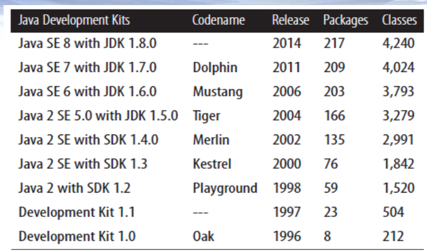

# Java类库及常用类

## Java类库统计及说明



从`JDK1.0`开始到后面的`JDK 8`，`Java`类库越来越庞大。主要是`java`、`javax`、`org`三个包

`java`：所有以`java.`开头的都是Java的核心包（`Java Core Package`）

`javax`：所有以 `javax.` 开始的包是 `Java` 扩展包 （`Java Extension Package`) ，例如 `javax.swing` 包；

`org`：第三方组织规范标准包，如`W3C`的`DOM`。

`JDK8API`组成如下图所示：


其中`rt.jar`是运行时必须依赖的包。该包是`Java`的核心，当然也有其他比较重要的包如：`jfr`、`zipfs`、`jce`等

`Java`中的所有`API`都是以包的形式进行组织，每个包提供了非常多的类、接口、异常类等等，这些东西组成`Java`的类库。

下面是核心类包对照表：

| 包名 | 描述 |
| ---- | ---- |
|   `java.lang.*`  | `Java` 编程语言的基本类库   |
|  `java.applet.*`  |   创建 `applet` 需要的所有类   |
|    `java.awt.*`    |   创建用户界面以及绘制和管理图形、图像的类   |
|  `java.io.*`  |     通过数据流、对象序列以及文件系统实现的系统输入、输出 |
|  `java.net.*`  |   用于实现网络通讯应用的所有类   |
|  `java.util.*`  |   集合类、时间处理模式、日期时间工具等各类常用工具包    |
|  `java.sql.*`  |   访问和处理来自于 `Java` 标准数据源数据的类   |
|  `java.text.*`  |   以一种独立于自然语言的方式处理文本、日期、数字和消息的类和接口   |
|  `java.security.*`  |  设计网络安全方案需要的一些类    |
|  `java.beans.*`  |   开发 `Java Beans` 需要的所有类   |
|  `java.math.*`  |  简明的整数算术以及十进制算术的基本函数    |
|  `java.rmi.*`  |   与远程方法调用相关的所有类   |
|  `java.nio.*`  |   提供了实现`NIO`（非阻塞`IO`）应用的所有类   |
|  `java.time.*`  | 提供了`Java`日期、时间类的新处理方式（`Java 8`新增包） |

| 包名                    | 解析                                                         |
| ----------------------- | ------------------------------------------------------------ |
| `javax.accessibility.*` | 定义了用户界面组件与提供对这些组件进行访问的辅助技术之间的协定。 |
| `javax.activation.*`    | activation拓展                                               |
| `javax.activity.*`      | 包含了解组期间通过ORB机制抛出异常的相关活动服务。            |
| `javax.annotation.*`    | `JSR330`扩展，包括一些常用的注解如：`@PostConstruct`、`@PreDestroy`等 |
| `javax.imageio.*`       | `Java Image I/O API` 的主要包。用于处理图像                  |
| `javax.jws.*`           | 提供一个轻量级`Web`服务框架（`JAX-WS`）                      |
| `javax.lang.model.*`    | 用来为 `Java` 编程语言建立模型的包的类和层次结构。 此包及其子包的成员适用于语言建模、语言处理任务和 `API`（包括但并不仅限于注释处理框架） |
| `javax.management.*`    | 提供 `Java Management Extensions` 的核心类。 `Java Management Extensions` (`JMXTM`) `API` 是一个用于管理和监视的标准 `API` |
| `javax.naming.*`        | 为访问命名服务提供类和接口。（`JNDI`）                       |
| `javax.net.*`           | 提供用于网络应用程序的类。                                   |
| `javax.print.*`         | 提供打印服务的类，为 `JavaTM Print Service API` 提供了主要类和接口。 |
| `javax.rmi.*`           | 包含 `RMI-IIOP` 的用户 `API`。                               |
| `javax.script.*`        | 这个包用来和`JavaScript`进行互操作,比如`Java`类可以调用`JavaScript`中的方法,而`JavaScript`也可调用 `Java`中的方法. |
| `javax.security.*`      | `Java`安全机制相关包                                         |
| `javax.smartcardio.*`   | 主要功能是通过虚拟机建立与标准`pc/sc`读卡器及卡片的通信（`JavaME`） |
| `javax.sound.*`         | `Java`音频控制包                                             |
| `javax.sql.*`           | `JDBC 3.0`特性，对`java.sql.*`进行补充，提供`Datasource`接口，连接池支持，分布式事务处理机制，`rowset` |
| `javax.swing.*`         | 提供一组轻量级（全部是 `Java` 语言）`UI`组件，尽量让这些组件在所有平台上的工作方式都相同，属于`Java`的第二代图形化 |
| `javax.tools.*`         | 为能够从程序（例如，编译器）中调用的工具提供接口。           |
| `javax.transaction.*`   | 包含解组期间通过 `ORB` 机制抛出的三个异常。                  |
| `javax.xml.*`           | 根据 `XML` 规范定义核心 `XML` 常量和功能。                   |

## Java中的API文档和Demo

### 官方类库文档

- `JavaSE 6`:[Overview (Java Platform SE 6)](https://docs.oracle.com/javase/6/docs/api/)
- `JavaSE 7`:[Overview (Java Platform SE 7)](https://docs.oracle.com/javase/7/docs/api/)
- `JavaSE 8`:[Overview (Java Platform SE 8 )](https://docs.oracle.com/javase/8/docs/api/)
- 各版本`Oracle`官网：[Java Platform, Standard Edition Documentation - Releases (oracle.com)](https://docs.oracle.com/en/java/javase/index.html)

### 第三方文档（中文）

[Java 官方文档 官方文档|官方教程|Java 官方文档 API中文手册|Java 官方文档参考文档_w3cschool](https://www.w3cschool.cn/java/dict)

[在线API文档 (oschina.net)](https://tool.oschina.net/apidocs/api)

[Java 8 中文版 - 在线API中文手册 - 码工具 (matools.com)](https://www.matools.com/api/java8)

## 常用类使用

### 数字包及数学相关类

`Java`中的数字类主要有下面几类：

- 用于包装基本类型的：`Short`、`Long`、`Double`等**包装器类**
- 用户处理大数的：`BigInteger`、`BigDecimal`
- 用于处理随机数的`Random`
- 用于处理特殊运算的`Math`工具
- `java.math`包下的类：如：


#### 包装器类

首先包装器类是基于各个基本类型的，在`JDK5`之后的版本，允许将包装器类和基本类型之间的相互转换的。如：

```java
Integer a = 23;	// int --> Integer（装箱）
int b = a;		// Integer --> int（拆箱 | 开箱）
// SpringBoot
```

对于数字处理这个分类，在`Java`中最基础的数字处理类是`Number`，他是一个抽象类，代表一个数，继承于`Number`类的类中**有我们常用的基本类型的包装类**，也有处于并发包（ `java.util.concurrent`）下的原子类。他们的继承关系图参考如下：


包装器类帮我们将一些基本类型的属性，如：**最大最小值、类型转换、进制转换等等**。

包装器类主要有下面几个：

- Byte
- Short
- Integer
- Long
- Float
- Double
- Character
- Boolean

```java
// API方法
Integer.parseInt()
Integer.parseUnsignedInt()
Integer.valueOf()
Integer.toString()
Integer.decode()
Integer.max()
Integer.min()
Integer.signum()
// ...
// 具体参考Github仓库JavaProjectfen'zhi
```

#### 大数类

众所周知，基本类型有一个范围限制。如果要想表示类似于9999999999999999这样的大数，即便是8个字节的`long`也无动于衷，这个时候就轮到下面两位大哥出场了：

- `BigInteger`：表示任意大的整数类型
- `BigDecimal`：表示任意大的浮点类型

两位大哥能够表示无限大的数。两位大哥的`API`可以参考下面两篇笔记：

[`BigInteger`类使用方法]()

[`BigDecimal`类使用方法]()

#### 随机类

随机类主要有两个类：

- `Random`：能够产生一个随机数
- `UUID`：能够产生一个随机字符序列

#### Math工具类

Math工具类为我们提供了许多和数学处理有关的东西，如计算幂次，平方根等。


### 字符串处理

字符串处理主要有四个大类：

- `String`
- `StringBuffer`
- `StringBuilder`
- `StringJoiner`

### 时间类（旧）

- `Date`
- `Calendar`

### 格式化类

- `NumberFormat`
- `MessageFormat`
- `DateFormat`

## API封装（作业）

字符串类：SQLBuilder

格式化类：FormatUtils

时间类：DateTimeUtils

基本包装类：CommonUtils


